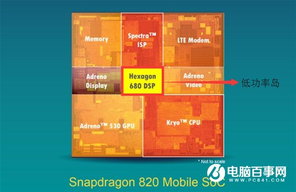

# Research report

   * [Research report](#research-report)
      * [Introduction](#introduction)
      * [Background](#background)
         * [C10K and C10M](#c10k-and-c10m)
            * [Introduction](#introduction-1)
            * [Solution](#solution)
            * [C10M is coming](#c10m-is-coming)
         * [Linux networking stack](#linux-networking-stack)
            * [Network stack](#network-stack)
            * [Core linux network architecture](#core-linux-network-architecture)
            * [kernel network core structures](#kernel-network-core-structures)
            * [The journey of a packet through linux network stack](#the-journey-of-a-packet-through-linux-network-stack)
         * [OS Kernel is insufficient](#os-kernel-is-insufficient)
         * [Programmable packet processing](#programmable-packet-processing)
            * [BPF](#bpf)
               * [Introduction](#introduction-2)
               * [Instruction set](#instruction-set)
               * [Example](#example)
            * [eBPF](#ebpf)
            * [Kernel-bypass solution](#kernel-bypass-solution)
               * [Why kernel-bypass](#why-kernel-bypass)
               * [DPDK](#dpdk)
               * [Snabb](#snabb)
               * [OpenOnload](#openonload)
               * [Drawback](#drawback)
            * [In-kernel solution](#in-kernel-solution)
               * [Why in-kernel](#why-in-kernel)
               * [XDP](#xdp)
         * [XDP](#xdp-1)
            * [How it works](#how-it-works)
               * [The XDP Driver Hook](#the-xdp-driver-hook)
         * [Programmatic usage](#programmatic-usage)
            * [A glance of XDP code](#a-glance-of-xdp-code)
               * [XDP Data structure](#xdp-data-structure)
               * [XDP Program return codes](#xdp-program-return-codes)
            * [Example](#example-1)
            * [Environment building](#environment-building)
         * [XDP vs DPDK](#xdp-vs-dpdk)
            * [General Design](#general-design)
            * [Programmability](#programmability)
            * [Device Support](#device-support)
            * [Performance](#performance)
            * [Pros of XDP](#pros-of-xdp)
            * [Production Use of XDP](#production-use-of-xdp)
      * [Related work (XDP)](#related-work-xdp)
      * [Importance &amp; Significance](#importance--significance)
         * [Android Background](#android-background)
            * [Mobile CPU Classification](#mobile-cpu-classification)
         * [Android wifi data path](#android-wifi-data-path)
         * [Network performance load stress tests](#network-performance-load-stress-tests)
            * [Linux(raw), XDP, DPDK](#linuxraw-xdp-dpdk)
            * [Android packet processing performance](#android-packet-processing-performance)
               * [Conclusion](#conclusion)
            * [Conclusion](#conclusion-1)
         * [About 4G](#about-4g)
            * [Definition](#definition)
            * [Specifications](#specifications)
         * [About 5G](#about-5g)
            * [5G concepts and prospects](#5g-concepts-and-prospects)
            * [Specifications](#specifications-1)
            * [4G vs 5G](#4g-vs-5g)
               * [Frequency](#frequency)
               * [Speed](#speed)
               * [Bandwidth](#bandwidth)
               * [latency](#latency)
               * [Conclusion](#conclusion-2)
         * [Future of Network (2017-2022)](#future-of-network-2017-2022)
            * [Global networking devices](#global-networking-devices)
            * [IP data traffic](#ip-data-traffic)
            * [Network flow](#network-flow)
            * [About 5G](#about-5g-1)
         * [Conclusion](#conclusion-3)
      * [Reference](#reference)

## Introduction

**该项目是将XDP移植至安卓平台，并进一步通过XDP在安卓上实现网络处理相关的应用。**
XDP是linux内核中一个强大、可编程、高效的网络数据通路。XDP在网络栈的最底层，以软件的方式实现了包处理和过滤，能运行在裸金属机器上。它在保持linux原本网络栈的情况下，提供了高效可编程的解决方案，相当于在linux网络栈中增加了预处理的一层。

考虑到网络的飞速发展和Android设备在5G时代不可替代的作用，Android设备的网络处理能力至关重要。CPU的包处理能力在如今来看已逐渐表现出不足。我们考虑将XDP移植至Android平台，从而实现移动设备高效的网络处理能力，并实现一些通过XDP能达成的高级功能。

## Background

### C10K and C10M

高性能网络处理需求（从C10K到C10M）

> C10K：单机1万个并发连接
> C10M：单机1千万个并发连接

#### Introduction

互联网的基础就是网络通信，早期的互联网可以说是一个小群体的集合。互联网还不够普及，用户也不多，一台服务器同时在线100个用户估计在当时已经算是大型应用了，所以并不存在什么 C10K 的难题。互联网的爆发期应该是在www网站，浏览器，雅虎出现后。最早的互联网称之为Web1.0，互联网大部分的使用场景是下载一个HTML页面，用户在浏览器中查看网页上的信息，这个时期也不存在C10K问题。

Web2.0时代到来后就不同了，一方面是普及率大大提高了，用户群体几何倍增长。另一方面是互联网不再是单纯的浏览万维网网页，逐渐开始进行交互，而且应用程序的逻辑也变的更复杂，从简单的表单提交，到即时通信和在线实时互动，C10K的问题才体现出来。因为每一个用户都必须与服务器保持TCP连接才能进行实时的数据交互，诸如Facebook这样的网站同一时间的并发TCP连接很可能已经过亿。

这时候问题就来了，最初的服务器都是基于进程/线程模型的，新到来一个TCP连接，就需要分配1个进程（或者线程）。而进程又是操作系统最昂贵的资源，一台机器无法创建很多进程。如果是C10K就要创建1万个进程，那么单机而言操作系统是无法承受的（往往出现效率低下甚至完全瘫痪）。如果是采用分布式系统，维持1亿用户在线需要10万台服务器，成本巨大，也只有Facebook、Google、雅虎等巨头才有财力购买如此多的服务器。

基于上述考虑，如何突破单机性能局限，是高性能网络编程所必须要直面的问题。这些局限和问题最早被Dan Kegel 进行了归纳和总结，并首次成系统地分析和提出解决方案，后来这种普遍的网络现象和技术局限都被大家称为 C10K 问题。

#### Solution

多年大量的实践证明，异步处理和基于事件（即epoll，kqueue和iocp）的响应方式成为处理这类问题的事实上标准方法。虽然epoll 已经可以较好的处理 C10K 问题，但是如果要进一步的扩展，例如支持 10M 规模的并发连接，原有的技术就无能为力了。

#### C10M is coming

十几年后，当摩尔定律在硬件上的理论提升有1000倍时，有人对并发数量提出了更高的要求，"C10K"升级为"C10M"问题，即每秒应对10M个客户端的同时访问。

最早提出"C10M"问题的Robert Graham认为，减少开销的关键之一在于绕过操作系统，即"kernel bypass"，因为我们使用的操作系统在设计之初并没有考虑高并发的场景，而I/O路径上的大部分例程又在内核空间中，大量无谓的消耗花在了内核空间和用户空间上下文的切换上。解决的方法就是将I/O路径（对于网络请求来讲，就是驱动和网络协议栈）全部实现在用户空间，这样可以最大程度的减少内核的干预，并且通过轮询(polling)而不是硬件中断的方法来获取网卡上的请求（而对于存储器来讲，就是complete信息）。再结合其他优化方法，例如协程和零拷贝技术，可以将并发性能优化到极致。

基于这样的背景，一种未来的趋势是出更多的硬件驱动将在用户空间中实现，而这种趋势似乎正在慢慢成为现实。例如Intel的***DPDK相关的技术***，以及***XDP技术***。

### Linux networking stack

这一节将主要大致描述 linux 网络栈的组成并且为何只靠内核的网络栈进行处理是低效率的。

#### Network stack

网络栈分为以下5层：


#### Core linux network architecture

这一节将讲述linux是如何实现上述网络栈的模型的。如下，是 linux 的网络架构。


- System call interface：这个为应用程序获取内核的网络系统提供了接口。
- Protocol agnostic interface：为和各种传输层协议的网络交互提供的一层公共接口。
- Network protocals：对各种传输层协议的实现，如TCP、UDP、IP等。
- Device agnostic interface：为各种底层网络设备抽象出的公共接口。
- Device drivers：与各种网络设备交互的驱动实现。

从上可以看出，linux的网络架构经过了层层抽象，在为开发带来便利的同时也将带来一定程度上的低效率。

#### kernel network core structures

- `sk_buff`：即套接字缓存 *socket buffer*，贯穿于整个 linux 协议栈，代表一个要发送或处理的报文。

  当一个报文通过了网卡引起终端之后，每一个报文都会在内存中分配一块区域，称为`sk_buff`。

- `net_device`：表示NIC。

#### The journey of a packet through linux network stack

这一节基于上面的基础，将概括一个报文到底是如何通过 linux 网络层到达用户应用程序的。

1. 当NIC收到一个帧（匹配本机MAC地址或者是一个链路层的广播），将通过DMA将报文移到环形缓冲区。
2. NIC引起硬件中断。
3. 硬件中断的handler将引起软件中断。
4. 驱动将处理这个中断，它将报文从环形缓冲区溢出，在内存中分配一个`skb`。并调用`netif_rx(skb)`，此例程归属于[上述](#core-linux-network-architecture)的Device agnostic interface。
5. 此`skb`将放入cpu处理报文的队列中。如果队列满了此包将丢掉。到这为止中断就处理结束了。
6. cpu处理到此报文时，调用`net_rx_action()`，这是此报文将从cpu的接受队列中移除。
7. 之后再进行与报文协议相关的高级处理。包括ip地址、校验和等等。

可以看出，一个报文从到达网卡至cpu可以处理此报文至进一步处理需要许多步骤。

在这里我们可以看出，对一个包的处理，哪怕这个包最后只是需要DROP掉或REDIRECT，也需要进行很多原本不必要的操作。

[这里](https://blog.cloudflare.com/kernel-bypass/)有一个测试。对linux在极限情况下进行报文处理速度的测试，即在最早的时间里drop掉该报文：

```shell
$ sudo iptables -t raw -I PREROUTING -p udp --dport 4321 --dst 192.168.254.1 -j DROP
$ sudo ethtool -X eth2 weight 1
$ watch 'ethtool -S eth2|grep rx'
     rx_packets:       12.2m/s
     rx-0.rx_packets:   1.4m/s
     rx-1.rx_packets:   0/s
     ...
```

结果发现，当网卡已12.2m pps(*packets per second*)的速度收取报文时，cpu的最高处理速度只能达到1.4m pps。linux严重限制了报文处理速度。

### OS Kernel is insufficient

这一节承接上一节，详细描述 linux kernel 在报文处理上的不足。

**中断处理**：当网络中大量数据包到来时，会产生频繁的硬件中断请求，这些硬件中断可以打断之前较低优先级的软中断或者系统调用的执行过程，如果这种打断频繁的话，将会产生较高的性能开销。

**内存拷贝**：正常情况下，一个网络数据包从网卡到应用程序需要经过如下的过程：数据从网卡通过 DMA 等方式传到内核开辟的缓冲区，然后从内核空间拷贝到用户态空间，在 Linux 内核协议栈中，这个耗时操作甚至占到了数据包整个处理流程的 57.1%。

**上下文切换**：频繁到达的硬件中断和软中断都可能随时抢占系统调用的运行，这会产生大量的上下文切换开销。另外，在基于多线程的服务器设计框架中，线程间的调度也会产生频繁的上下文切换开销，同样，锁竞争的耗能也是一个非常严重的问题。

**局部性失效**：如今主流的处理器都是多个核心的，这意味着一个数据包的处理可能跨多个 CPU 核心，比如一个数据包可能中断在 cpu0，内核态处理在 cpu1，用户态处理在 cpu2，这样跨多个核心，容易造成 CPU 缓存失效，造成局部性失效。如果是 NUMA 架构，更会造成跨 NUMA 访问内存，性能受到很大影响。

**内存管理**：传统服务器内存页为 4K，为了提高内存的访问速度，避免 cache miss，可以增加 cache 中映射表的条目，但这又会影响 CPU 的检索效率。

我们可以先设想一下：如果一个包刚刚被启动从环形缓冲区中取出，就进行用户定义的包过滤/处理操作，那将能显著提升效率。事实上这就是下面将详细介绍的XDP几乎能赶上DPDK都能kernel bypass解决方案的基本原理。也可以说，它在linux的网络栈中加了新的一层。

### Programmable packet processing

kernel的网络处理是一套集成、完整、通用的包处理方式，但对用户而言，这种通用化的方式可能不够用。在软件层面自己实现包处理将带来低效，于是可编程的包处理方案应运而生。

#### BPF

##### Introduction

BPF，及伯克利包过滤器Berkeley Packet Filter，最初构想提出于 1992 年，其目的是为了提供一种过滤包的方法，并且要避免从内核空间到用户空间的无用的数据包复制行为。它最初是由从用户空间注入到内核的一个简单的字节码构成，它在那个位置利用一个校验器进行检查 —— 以避免内核崩溃或者安全问题 —— 并附着到一个套接字上，接着在每个接收到的包上运行。几年后它被移植到 Linux 上，并且应用于一小部分应用程序上（例如，`tcpdump`）。其简化的语言以及存在于内核中的即时编译器（JIT），使 BPF 成为一个性能卓越的工具。

##### Instruction set

它通过底层的一个BPF虚拟机执行字节码。BPF的字节码本质是一个RISC指令集。能通过书写高级语言，并使用编译后端将其编译为C（主要是LLVM）。这里的高级语言是C语言特性的一个子集。之后虚拟机将通过一个JIT编译器来将字节码翻译为指令来执行。

##### Example

```c
#include <linux/bpf.h>

#ifndef __section
# define __section(NAME)                  \
   __attribute__((section(NAME), used))
#endif

#ifndef __inline
# define __inline                         \
   inline __attribute__((always_inline))
#endif

static __inline int foo(void)
{
    return XDP_DROP;
}

__section("prog")
int xdp_drop(struct xdp_md *ctx)
{
    return foo();
}

char __license[] __section("license") = "GPL";

```

#### eBPF

eBPF是对cBPF（即classic BPF，指BPF，相对于eBPF）的拓展。它扩充了BPF的功能，丰富了BPF的指令集，并提供了一些新的hook。

BPF提供两个选项，BPF的基本思想是对用户提供两种`SOCKET`选项：`SO_ATTACH_FILTER`和`SO_ATTACH_BPF`，允许用户在`sokcet`上添加自定义的`filter`，只有满足该`filter`指定条件的数据包才会上发到用户空间。`SO_ATTACH_FILTER`插入的是`cBPF`代码，`SO_ATTACH_BPF`插入的是`eBPF`代码。

#### Kernel-bypass solution

##### Why kernel-bypass

从上面的[linux网络栈](#Linux-networking-stack)可以看出，linux内核对包的处理十分复杂。每个报文的处理过多，降低了整个系统的效率。为了达到高效率，绕过内核的想法就自然地产生了。

这种解决方案是越过整个内核的处理过程，全权交给应用。通过整个CPU来进行包处理。显著地提供了效率。

##### DPDK

DPDK是intel提供的x86平台上的一套完整的可编程高效包处理的工具包。

在X86结构中，处理数据包的传统方式是CPU中断方式，即网卡驱动接收到数据包后通过中断通知CPU处理，然后由CPU拷贝数据并交给协议栈。在数据量大时，这种方式会产生大量CPU中断，导致CPU无法运行其他程序。

而DPDK则采用[轮询](https://zh.wikipedia.org/wiki/%E8%BC%AA%E8%A9%A2)方式实现数据包处理过程：DPDK重载了网卡驱动，该驱动在收到数据包后不中断通知CPU，而是将数据包通过[零拷贝](https://zh.wikipedia.org/wiki/%E9%9B%B6%E6%8B%B7%E8%B4%9D)技术存入内存，这时应用层程序就可以通过DPDK提供的接口，直接从内存读取数据包。

这种处理方式节省了CPU中断时间、内存拷贝时间，并向应用层提供了简单易行且高效的数据包处理方式，使得网络应用的开发更加方便。但同时，由于需要重载网卡驱动，因此该开发包目前只能用在部分采用Intel网络处理芯片的网卡中。

由于通过轮询的方式，DPDK也带来了CPU的高负荷。DPDK一般运行于一整个CPU核上，并将占用100%的CPU。

##### Snabb

[Snabb](https://github.com/snabbco/snabb)是一个简单快速的网络工具包。它通过Lua语言编写。Snabb会编译为可执行文件`snabb`，能运行在linux x86/64平台上。

Snabb具有高扩展性、虚拟化特性。它同样也可以在container中使用。

##### OpenOnload

[OpenOnload](https://www.openonload.org/)是Softflare提出的一个高效的网络栈。它基于标准的BSD sockets API，不需要修改应用就可以使用。它能显著提高信息传输速率，降低延迟。它在用户层运行，同样越过了整个linux内核。

##### Drawback

Kernel-bypass在带来高效的同时，也带来了一些问题。

- 它们跳过了整个操作系统，全权交给应用，因此带来安全上的问题。
- 它们难以与现有的系统集成，应用必须重新实现一些本来由操作系统网络栈提供的功能。
- 操作系统提供的工具和部署策略无法使用。
- 提升了系统复杂性，模糊了安全上本来由操作系统控制的边界。

#### In-kernel solution

##### Why in-kernel

正是在kernel-bypass问题的基础上，in-kernel体现了其重要性。

并且它置身于内核，用户不需要安装第三方工具即可使用，并且由于在linux内核中，用户不需要配置新的开发环境。

##### XDP

然而，正是因为linux内核对报文做了过多的处理降低了效率，我们才需要跳过内核。如果这个工具本身就在内核中，效率不是很慢吗？

XDP完美的解决了这个问题。它相当于在linux网络栈中加了新的一层。在报文到达CPU的最早时刻进行处理，甚至避免了`skb`的分配，从而减少了内存拷贝上的负荷。同时，XDP又提供了一套完整的、可编程的报文处理方案。

下面将详细介绍XDP。

### XDP

#### How it works

XDP设计背后的理念是在保证安全性和系统其余部分完整性的前提下，与操作系统内核协同，进行高性能包处理。图一显示了XDP是如何集成进操作系统内核的。


**figure1**：XDP与Linux网络堆栈的集成。在数据包到达时，在触摸数据包数据之前，设备驱动程序在主XDP挂钩中执行eBPF程序。该程序可以选择丢弃数据包;将它们发回到收到的同一界面；通过special AF_XDP套接字将它们重定向到另一个接口或用户空间；或者允许它们继续进行整体网络堆栈，其中一个单独的TC BPF挂钩可以执行进一步处理，然后进行数据包队列传输。不同的eBPF程序可以通过使用相互之间和用户空间进行通信。 

图2显示了典型XDP程序的执行流程。主要有四个XDP系统的组件：

+ XDP driver hook 是XDP的主要入口点程序，并在从收到数据包时执行硬件。
+ The eBPF virtual machine 执行的字节代码XDP程序，及时编译它以增加性能。
+ BPF map 用作主要的key/map存储通信通道到系统的其余部分。
+ The eBPF verifier eBPF验证程序在它们之前静态验证程序加载,以确保它们不会崩溃或损坏运行内核。


##### The XDP Driver Hook

每次包到来时，XDP程序由网络设备驱动中的hook 运行。执行程序的基础设施是作为库函数包含在内核中，这意味着程序直接在设备驱动程序中执行，没有上下文切换到用户空间。如图1所示，程序在收到数据包后的最早时刻执行硬件，在内核分配每个包的sk_buff数据之前构造或执行包的任何解析。

图2显示了通常通过XDP程序执行的各种处理步骤。当程序有一个context object时程序开始执行。这个对象包含指向原始包的指针数据，以及描述是从哪个接口和的接收队列获得的数据包的元数据。

程序通常从解析包数据开始，并且可以因此，通过tail调用将控件传递给另一个XDP程序将处理划分为逻辑子单元(例如，基于IP header version)。

在解析包数据之后，XDP程序可以使用上下文对象来读取与包关联的元数据fields(描述数据包从什么接口和接收队列来)。上下文对象还可以访问特殊的内存区域(位于存储器中的分组数据), XDP程序可以使用此内存将自己的元数据附加到数据包，当它穿过系统时将随身携带。

除了每个数据包的元数据，XDP程序还可以定义和访问自己的持久数据结构（通过BPF map），它可以通过各种帮助功能访问内核设施。map允许该程序与系统的其余部分进行通信，并且帮助者允许它有选择地利用现有的内核功能（如路由表），且无需通过完整的内核
网络堆栈。新的辅助功能由内核开发社区不断提供，从而不断扩展XDP程序可以使用的功能。

最后，程序可以对包数据的任何部分进行写操作，包括扩展或缩小数据包缓冲区来添加或删除头文件。这允许它执行封装或解封装。比如，各种内核辅助函数可以用于协助类似校验和计算修改后的操作包的功能。

这三个步骤（阅读，元数据处理和写作分组数据）对应于图2左侧的浅灰色框.由于XDP程序可以包含任意指令，因此不同的步骤可以以任意方式交替和重复。

在处理结束时，XDP程序最终发布对于数据包的判定。

### Programmatic usage

#### A glance of XDP code

##### XDP Data structure

XDP会将 packet 以数据的形式传给BPF（以下的BPF指eBPF）程序，packet在XDP中的数据结构为：

```c
struct xdp_buff {
    void *data;
    void *data_end;
    void *data_meta;
    void *data_hard_start;
    struct xdp_rxq_info *rxq;
};
```

这里，`data`指向报文数据的开始，`data_end`指向报文数据的结束。

`data_hard_start`，是由于`headroom`的存在，报文的header空间已经提前分配了，`data_hard_start`指向当前报文header的开始。当包经过再封装时（即加入了新的header），通过`bpf_xdp_adjust_head()`，`data`会离`data_hard_start`更近。

`data_meta`最开始和`data`指向同一处，通过`bpf_xdp_adjust_meta()`，`data_meta`会指向元数据信息。这串信息对linux的网络栈是不可见的，但能被BPF程序所用。这样，指针的大小顺序就是：`data_hard_start` <= `data_meta` <= `data` < `data_end`。

`rxq `是rx queue的一串数据，它存在于`ring`的建立期。`xdp_rxq_info`的数据结构如下：

```c
struct xdp_rxq_info {
    struct net_device *dev;
    u32 queue_index;
    u32 reg_state;
} ____cacheline_aligned;
```

##### XDP Program return codes

XDP程序的返回值如下：

```c
enum xdp_action {
    XDP_ABORTED = 0,
    XDP_DROP,
    XDP_PASS,
    XDP_TX,
    XDP_REDIRECT,
};
```

此返回值会告诉网卡驱动接下来如何处理报文。

`XDP_DROP`表示接下来会直接丢掉该packet。与软件上的实现不同，此`DROP`不会消耗任何资源，甚至不会为该packet分配`skb_buff`，用这个能大大加快效率。（从这里可以看出，XDP十分适合用于防范DDoS攻击）。

`XDP_PASS`表示该packet会被交给Linux内核[一般的网络栈处理](#linux-networking-stack)。

`XDP_TX`表示该packet会被传输出刚刚到达的NIC。通过这个能在对该packet进行一些处理后，传输出该网卡。这个在做load balancing上十分有用。

`XDP_REDIRECT`表示packet会被传输给其它的NIC。这个与`XDP_TX`配合使用，能构造出高效的load balancing。

`XDP_ABORTED`大致行为与`XDP_PASS`相似，不过他还会引起`trace_xdp_exception`，这个能用于监测错误行为。

#### Example

```c
/* map used to count packets; key is IP protocol, value is pkt count */
struct bpf_map_def SEC("maps") rxcnt = {
    .type = BPF_MAP_TYPE_PERCPU_ARRAY,
    .key_size = sizeof(u32),
    .value_size = sizeof(long),
    .max_entries = 256,
};

/* swaps MAC addresses using direct packet data access */
static void swap_src_dst_mac(void *data)
{
    unsigned short *p = data;
    unsigned short dst[3];
    dst[0] = p[0];
    dst[1] = p[1];
    dst[2] = p[2];
    p[0] = p[3];
    p[1] = p[4];
    p[2] = p[5];
    p[3] = dst[0];
    p[4] = dst[1];
    p[5] = dst[2];
}

static int parse_ipv4(void *data, u64 nh_off, void *data_end)
{
    struct iphdr *iph = data + nh_off;
    if (iph + 1 > data_end)
        return 0;
    return iph->protocol;
}

SEC("xdp1") /* marks main eBPF program entry point */
int xdp_prog1(struct xdp_md *ctx)
{
    void *data_end = (void *)(long)ctx->data_end;
    void *data = (void *)(long)ctx->data;
    struct ethhdr *eth = data;
    int rc = XDP_DROP;
    long *value;
    u16 h_proto;
    u64 nh_off;
    u32 ipproto;

    nh_off = sizeof(*eth);
    if (data + nh_off > data_end)
        return rc;

    h_proto = eth->h_proto;

    /* check VLAN tag; could be repeated to support double-tagged VLAN */
    if (h_proto == htons(ETH_P_8021Q) || h_proto == htons(ETH_P_8021AD))
    {
        struct vlan_hdr *vhdr;

        vhdr = data + nh_off;
        nh_off += sizeof(struct vlan_hdr);
        if (data + nh_off > data_end)
            return rc;
        h_proto = vhdr->h_vlan_encapsulated_proto;
    }

    if (h_proto == htons(ETH_P_IP))
        ipproto = parse_ipv4(data, nh_off, data_end);
    else if (h_proto == htons(ETH_P_IPV6))
        ipproto = parse_ipv6(data, nh_off, data_end);
    else
        ipproto = 0;

    /* lookup map element for ip protocol, used for packet counter */
    value = bpf_map_lookup_elem(&rxcnt, &ipproto);
    if (value)
        *value += 1;

    /* swap MAC addrs for UDP packets, transmit out this interface */
    if (ipproto == IPPROTO_UDP)
    {
        swap_src_dst_mac(data);
        rc = XDP_TX;
    }
    return rc;
}
```

为了展示上面描述的功能，上面显示了一个一个简单的XDP程序的例子。该程序将解析数据包头文件，并通过交换源和目标MAC地址来反映所有UDP数据包。虽然这显然是一个非常简单的例子，但是这个程序的确代表了现实中非常有用的XDP程序的大部分特点。

+ BPF地图（第1-7行）以保持统计数据处理的数据包数量。地图以IP协议号为基础，并且每个值只是一个简单的包计数（在第60-62行更新）。用户空间程序可以轮询它，以在XDP程序运行时输出数据。
+ 指向数据包开始和结束的指针从
  上下文对象读取（第30-31行），用于直接包数据访问。
+ 检查data_end指针可确保没有数据读出界限（第22,36和47行）。验证者确保甚至跨指针副本的正确性（如第21-22行）。
+ 程序必须处理任何数据包解析本身，包括诸如VLAN头之类的东西（第41-50行）
+ 直接分组数据访问用于修改分组报头（第14-16行）。
+ 内核公开的映射查找辅助函数（在第60行上调用）。这是唯一真正的函数调用程序;所有其他函数都在编译时内联，包括像`htons()`这样的帮助器。
+ 最终的数据包判决由程序传达返回码（第69行）。

当程序被安装在接口上时，首先被编译为eBPF字节码，然后由 verifier 检查。值得注意的事情在这种情况下由 verifier 检查以下几项

- 循环的展开和程序的总大小
- 报文数据进行了数组边界检查
- 传递给`bpf_map` 的参数大小符合定义
- `bpf_map` 的返回值不是`NULL`

#### Environment building

为了编译XDP/eBPF的代码，需要llvm提供的BPF后端。环境要求如下：

- clang >= version 3.4.0
- llvm >= version 3.7.1

安装开发环境，键入如下命令：

```shell
$ sudo apt-get install -y make gcc libssl-dev bc libelf-dev libcap-dev \
  clang gcc-multilib llvm libncurses5-dev git pkg-config libmnl bison flex \
  graphviz
```

### XDP vs DPDK

#### General Design

DPDK采取的是一种越过操作系统内核的方式（kernel bypass）。下图是DPDK的原理图。

包处理完全通过用户空间的程序来处理，在提升效率的同时，操作系统内核的程序隔离、安全机制也不再起作用，导致了不安全性。同样的，一些基于内核功能的成熟的部署、管理和配置工具也不再起作用。

为了提高效率，DPDK采用轮询的方式，无论在何种情况下，都需要一整个CPU来处理，CPU占用率一直是100%。

XDP直接集成在内核中。由于直接运行在内核中，内核提供了一个安全的执行环境。这样它保证了内核安全性，不需要更改网络配置，不需要硬件的特殊支持，只需要在网卡的驱动中实现XDP hook。因而为packet processing提供了一个更轻量级的解决方案。


一般而言通过了内核效率可能会成为问题，而XDP为了缩小与DPDK的效率，它在更早的阶段处理包——即packet刚到达，在CPU所能进行处理的最早阶段。

> XDP is a further step in evolution and enables to run a specific flavor of BPF programs from the network driver with direct access to the packet's DMA buffer. This is, by definition, the earliest possible point in the software stack, where programs can be attached to in order to allow for a programmable, high performance packet processor in the Linux kernel networking data path.
>
> At this point in the fast-path the driver just picked up the packet from its receive rings, without having done any expensive operations such as allocating an `skb` for pushing the packet further up the networking stack, without having pushed the packet into the GRO engine, etc. Thus, the XDP BPF program is executed at the earliest point when it becomes available to the CPU for processing. 

这样，XDP跳过了一些网络处理层，在很早的阶段对packet进行了处理。它直接操作DMA(Direct Memory Access) buffer，还没有为packet分配skb空间。同时XDP没有内存分配，进一步提高了效率。

#### Programmability

XDP通过eBPF提供了一套十分灵活的可编程解决方案。它将可编程性直接植入操作系统的网络栈中。XDP在运行过程中，不需要对网络进行任何操作，而可以直接替换XDP运行的eBPF程序。

> Can be dynamically re-programmed without any service interruption, which means that features can be added on the fly or removed completely when they are not needed without interruption of network traffic,and that processing can react dynamically to conditions in other parts of the system.

DPDK则是提供一套包处理库，程序员在软件层面、跳过操作系统内核编写包处理程序。

#### Device Support

相对来说，DPDK支持更多的网卡驱动。由于DPDK是一套已经成熟的工业解决方案，它几乎支持所有的intel网卡。而XDP还在不断地开发中，仍有部分网卡没有充分支持。

#### Performance

- packet drop

- packet forwarding

可以看出，DPDK的总体效率更高，但在单核的情况下， packet forwarding的效率已相差无几，且在扩展性上面XDP更好。

#### Pros of XDP

- 用户应用程序透明
- 不需要整个CPU进行轮询
- 由于使用eBPF，eBPF程序将编译为byte code，因此在不同机器上XDP的程序**不需要重新编译**即可直接使用。
- 和操作系统内核紧密地结合，提供了安全性，也更方便部署。

#### Production Use of XDP

[katran](https://github.com/facebookincubator/katran)

[cilium](https://github.com/cilium/cilium)

## Related work (XDP)

* XDP的首届峰会直到2016年才举行，它正处于方兴未艾的发展阶段，正适合做进一步的研究和应用。

  XDP的相关使用场景：

* DDoS过滤：通过CloudFlare实现内核绕过，单个RX队列绕过Netmap，使用eBPF过滤丢弃坏包并重新注入好的数据包。XDP可以避免使用eBPF重新注入好数据包时解析数据包“inline”，目前还可以进行进一步优化。
* 负载平衡：对于不是localhost的数据包，XDP_TX转发到负责终止流量的服务器，需要与Tunnel标头decap/encap结合使用。
* 路由器：在eBPF中实现路由器/转发数据平面，但由于多端口TX尚未实现，目前主要是DPDK在做这项工作。
* L2 learning bridge：在多端口TX实现的前提下，则可通过XDP程序访问端口设计。

## Importance & Significance

### Android Background
#### Mobile CPU Classification

**AP应用处理器：**

手机CPU中最主要的一部分，手机的系统运作还有APP的运行，靠的都是AP应用处理器。例如：苹果A9处理器指的就是AP。


**BP基带处理器：**

基带处理器管理的是手机一切无线信号（除了wifi，蓝牙，NFC等等），一款手机支持多少种网络模式，支持4G还是3G，都是由基带部分决定的。BP做的最有名的是高通，其实高通发家靠的就是优秀的BP基带处理器，而不是AP应用处理器。


**CP多媒体加速器：**

其实每个厂商对CP都有不同的名字，比如苹果把它叫做协处理器，高通820叫做“低功率岛”。在早期CP只用于解码视频和处理音频等等简单任务。


但是各大厂商发现，CP的性能其实也可以很高，于是开始处理的东西越来越多。现在的CP已经可以处理虚拟现实，增强现实，图像处理，HIFI，HDR，传感器等等。



###	Android wifi data path

Android的内核是根据Linux内核的长期支持的分支，具有典型的Linux调度和功能。截至2018年，Android的目标是Linux内核的4.4、4.9或是4.14版本。实际的内核取决于单个设备。

由于Android继承自linux，Android内部网络数据通路和Linux基本相同，Android对网络数据的处理也是经过内核的。而且由于Java虚拟机的缘故，相比一般的linux系统，安卓中网络数据通路更长。


在WiFi的系统结构图中，网络数据从上到下经过了四层：Java应用层->Java架构层->C框架层->内核空间层。

### Network performance load stress tests

#### Linux(raw), XDP, DPDK


(此结果运行于Xeon E5-1650 V4@3.7Hz 单个核心上)

通过查询文献可以发现，基于内核的传统的数据传输性能并不是非常强，最高性能只为5Mpps。而采用了DPDK和XDP技术，单个核心的包处理能力得到了显著提升。我们可以从表中得出以下结论：

* Linux下CPU负担和包处理能力成比较好的线性关系。
* 相同CPU负载下，XDP提升单个核心至少两倍包处理能力；在CPU高负载情况下，提升包处理能力近5倍。
* DPDK采用轮询策略，始终占用百分之百的CPU利用率。
* 当包处理量不大的情况下，XDP相比DPDK效率更高，但DPDK对CPU高性能网络处理能力提升作用更为显著。

千兆网络大约需要CPU具有1.4Mpps的包处理能力，从图表上我们可以知道在没有XDP或者DPDK技术加持下，CPU负担大约为30%左右。但是对于智能手机的CPU，其性能相对于桌面CPU、服务器CPU性能更为孱弱，处理千兆网络无疑将会占用其大部分CPU资源。

我们通过简单的测试验证了我们的猜想。

#### Android packet processing performance

我们选取了一位组员的Android设备（SoC：骁龙625）进行比较简单的网络负担测试，分别测试了4GLTE、WIFI、流量转发下CPU占用率。

* 4GLTE网络下


（其中前半段位下载，后半段为上传）

在下载11.95Mbps、上传29.21Mbps条件下，CPU平均使用率为40.13%。相同待机条件下CPU使用率仅为21.27%，CPU使用率提高了18.86%。

* WIFI网络下


（其中前半段位下载，后半段为上传）

在下载23.28Mbps，上传22.38Mbps条件下，CPU平均使用率为35.68%；相同待机条件下，CPU平均使用率为19.81%，CPU使用率提高16.87%

* 流量转发

（其中前半段位下载，后半段为上传）

在进行数据处理性能测试的同时，我们还进行了数据转发的性能测试。使用在WIFI热点转发流量状态，下载14.73Mbps，上传14.93Mbps的情况CPU平均使用率为12.56%，而相同条件，设备待机CPU使用率仅为6.74%。

##### Conclusion

* 骁龙625处理器在处理20Mbps的的数据会吃点近五分之一的CPU资源，转发15Mbps会占用百分之六的CPU使用率
* 根据流量处理和CPU使用率的线性关系，我们可以推测出，骁龙625能够比较好的处理百兆网络，但是对于跑满千兆网络可能会非常吃力，甚至做不到。
* 根据我们的测试结果，上传相比下载占用CPU资源更少。
* 数据出现大的波动是因为难以保持测试环境的纯净性。

#### Conclusion

目前4G和WIFI网络传输速率普遍不会超过百兆，手机SoC还是能够处理的。但是当5G来临，手机SoC不得不具备千兆网络的处理能力。我们测试的骁龙625尽管不是目前最强的android设备SoC，但是还是可以推断出，千兆网络处理将占据大部分手机CPU资源。而在linux上采用XDP技术，处理相同的网络数据，可以显著的降低CPU占用率，所以我们打算将XDP技术移植到Android上以提高移动设备千兆网络的处理能力。

### About 4G

4G指的是**第四代移动通信技术**，是3G之后的衍生。

#### Definition

从技术标准的角度看，按照[ITU](https://zh.wikipedia.org/wiki/ITU)的定义，静态传输速率达到1Gbps，用户在高速移动状态下可以达到100Mbps，就可以作为4G的技术之一。

从[运营商](https://zh.wikipedia.org/wiki/%E7%94%B5%E4%BF%A1%E8%BF%90%E8%90%A5%E5%95%86)的角度看，除了与现有网络的可兼容性外，4G要有更高的数据吞吐量、更低时延、更低的建设和运行维护成本、更高的鉴权能力和安全能力、支持多种[QoS](https://zh.wikipedia.org/wiki/QoS)等级。

从融和的角度看，4G意味着更多的参与方，更多技术、行业、应用的融合，不再局限于电信行业，还可以应用于金融、医疗、教育、交通等行业；通信终端能做更多的事情，例如除语音通信之外的多媒体通信、远端控制等；或许局域网、互联网、电信网、广播网、卫星网等能够融为一体组成一个通播网，无论使用什么[终端](https://zh.wikipedia.org/wiki/%E7%B5%82%E7%AB%AF)，都可以享受高质量的信息服务，向宽带无线化和无线宽带化演进，使4G渗透到生活的方方面面。

从用户需求的角度看，4G能为用户提供更快的速度并满足用户更多的需求。移动通信之所以从模拟到数字、从[2G](https://zh.wikipedia.org/wiki/2G)到4G以及将来的xG演进，最根本的推动力是用户需求由无线语音服务向无线多媒体服务转变，从而激发营运商为了提高[ARPU](https://zh.wikipedia.org/wiki/ARPU)、开拓新的频段支持用户数量的持续增长、更有效的[频谱](https://zh.wikipedia.org/wiki/%E9%A2%91%E8%B0%B1)利用率以及更低的营运成本，不得不进行变革转型。

#### Specifications

ITU的4G标志制定如下：

- 基于全[IP](https://zh.wikipedia.org/wiki/IP)（All IP）分组交换网络。
- 在高速移动性的环境下达到约100 Mbit/s的速率，如移动接入；在低速移动性的环境下高达约1 Gbit/s的速率，例如游牧/固定无线网络接入的峰值数据速率。
- 能够动态地共享和利用网络资源来支持每单元多用户同时使用。
- 使用5-20MHz可扩展的信道带宽，任选高达40 MHz。
- 链路频谱效率的峰值为15 bit/s/Hz（下行）和6.75 bit/s/Hz（上行）（即1 Gbit/s的下行链路中应该是可能超过小于67 MHz的带宽）。
- 系统的频谱效率下行高达3 bit/s/Hz/cell 和在室内2.25 bit/s/Hz/cell。
- 跨不同系统网络的平滑切换。
- 提供高质量的服务QoS(Quality of Service)，为支持新一代的多媒体传输能力。

### About 5G

5G指的是**第五代移动通信技术**，是4G之后的衍生。

#### 5G concepts and prospects

5G与4G相比，概念是连线容量有着巨大提升，并仰赖物联网的需求而建设成形。届时所有物品之间的链接均可容纳，举个直观一点的例子，就是除了电源，外部链接线均可以剪掉。8K电视与高端音响不再需要视频与音频线而能直接联上服务，PC只剩下键盘与鼠标，算力是进行订阅选配的套餐制，透过云服务将会更深度的集成到所有家电中，家电全面联网远程控制、声控的时代也将成为现实，街头上动态交通信号量得以出现、监控镜头也将为非固定式、行车纪录不再需要本地存储等等。以上均是5G的基本利用场景。

#### Specifications

下一代移动网络联盟（Next Generation Mobile Networks Alliance）定义了5G网络的以下要求：

- 以10Gbps的数据传输速率支持数万用户；
- 以1Gbps的数据传输速率同时提供给在同一楼办公的许多人员；
- 支持数十万的并发连接以用于支持大规模传感器网络的部署；
- 频谱效率应当相比4G被显著增强；
- 覆盖率比4G有所提高；
- 信令效率应得到加强；
- 延迟应显著低于LTE。

#### 4G vs 5G

4G 和 5G 之间有多种差异：

- 5G 是一个统一平台，功能比 4G 更强大
- 5G 使用的频谱优于 4G
- 5G 的速度比 4G 更快
- 5G 的网络容量比 4G 更大
- 5G 的延迟比 4G 更低

##### Frequency

从低于 1 GHz 的低频段到 1 GHz 至 6 GHz 的中频段，再到被称为毫米波的高频段，5G 还将充分利用各种可用频谱管理范式和频段中的每一个频谱。

##### Speed

5G 将在 4G 的基础上显著提速，达到 20 千兆/秒的峰值数据传输速率和超过 **100 兆/秒**的平均数据传输速率。

##### Bandwidth

5G 的流量容量和网络效率将提高 100 倍。

##### latency

5G 的延迟将大幅下降，以提供更即时的实时访问：端到端延迟降低 10 倍至 1 毫秒。

##### Conclusion

移动通信技术的发展和进步，对移动互联网最为直观的影响便是网速越来越快。

从2G的100Kbps、3G的2Mbps到4G的100Mbps、5G的1Gbps。网速有了近万倍的提升，但同时也对移动终端的网络性能带来了不小的挑战。


### Future of Network (2017-2022)

#### Global networking devices

根据Cisco公司的的预测，在全球范围内，在网设备数目将会继续飞速增长。其中支持物联网（IoT）应用的M2M联接，例如智能电表、视频监控、医疗监控、运输、包裹或资产跟踪，数量增长速度最为瞩目，其数量将从2016年的171亿增长为2021年的271亿；从34%的占比达到51%的占比。

智能手机的增长是第二快速的，达到百分之九的复合年增长率。


#### IP data traffic

全球的IP的流量也将持续并高速的增长，达到26%的复合年增长率。在2017年底，智能手机对IP流量的贡献仅为18%，而预计到2022年44%的IP流量将会来自智能手机。


#### Network flow

同样的，在接下来的五年中，全球网络流量也将会高速的增长。随着移动互联网的发展，视频设备将对全球流量产生更高的贡献。一台可以上网的高清电视每天可以从互联网上获取2小时的内容，它所产生的网络流量相当于今天整个家庭的网络流量。随着智能手机和平板电脑视频观看量的增长，来自这些设备的流量占互联网总流量的比例也在增长。随着到2022年，个人电脑在全球互联网流量中所占的份额将从2017年的49%下降至19%。到2022年，智能手机将占全球互联网流量的50%，高于目前的23%


#### About 5G

在思科的报告中，也提到了5G。全球5G设备将占全球移动设备和连接的3％以上。

到2022年，全球移动设备将从2017年的86亿增长到2022年的123亿 - 其中超过4.22亿的设备具有5G上网能力。到2022年，全球移动流量的近12％将用于5G蜂窝连接。

到2022年，全球平均5G连接每月将产生21 GB的流量。

> **Global 5G mobile highlights** 
>
> **5G devices and connections will be over 3 percent of global mobile devices and connections by 2022.**
>
> By 2022, global mobile devices will grow from 8.6 billion in 2017 to 12.3 billion by 2022 - over 422 million of those will be 5G capable.
>
> **Nearly twelve percent of global mobile traffic will be on 5G cellular connectivity by 2022.** 
>
> Globally, the average 5G connection will generate 21 GB of traffic per month by 2022.

### Conclusion

我们根据一些国际知名数据公司的预测，以及移动通信技术的发展趋势，可以明了的判断出在接下来的数年，智能手机将会越来越多，智能手机产生和处理的网络流量将会越来越大，但这也对手机网络处理能力提出了不小的挑战。而基于OS内核的传统数据传输存在不小的弊端，使得网络处理对CPU资源开销较大。

> 基于OS内核的传统数据传输存在的弊端：
>
> - **中断处理**：当网络中大量数据包到来时，会产生频繁的硬件中断请求，这些硬件中断可以打断之前较低优先级的软中断或者系统调用的执行过程，如果这种打断频繁的话，将会产生较高的性能开销。
> - **内存拷贝**：正常情况下，一个网络数据包从网卡到应用程序需要经过如下的过程：数据从网卡通过 DMA 等方式传到内核开辟的缓冲区，然后从内核空间拷贝到用户态空间，在 Linux 内核协议栈中，这个耗时操作甚至占到了数据包整个处理流程的 57.1%。
> - **上下文切换**：频繁到达的硬件中断和软中断都可能随时抢占系统调用的运行，这会产生大量的上下文切换开销。另外，在基于多线程的服务器设计框架中，线程间的调度也会产生频繁的上下文切换开销，同样，锁竞争的耗能也是一个非常严重的问题。
> - **局部性失效**：如今主流的处理器都是多个核心的，这意味着一个数据包的处理可能跨多个 CPU 核心，比如一个数据包可能中断在 cpu0，内核态处理在 cpu1，用户态处理在 cpu2，这样跨多个核心，容易造成 CPU 缓存失效，造成局部性失效。如果是 NUMA 架构，更会造成跨 NUMA 访问内存，性能受到很大影响。
> - **内存管理**：传统服务器内存页为 4K，为了提高内存的访问速度，避免 cache miss，可以增加 cache 中映射表的条目，但这又会影响 CPU 的检索效率。

智能手机中，安卓手机占比超过七成。而根据我们的粗略的测试结果得出的结论，目前Android手机SoC对百兆流量还能够轻松应对 ，但是并不能有效的应对5G下千兆网络，手机SoC还特别重视能耗比和发热量，所以非常有必要提高手机千兆网络的处理能力。所以我们打算将一些linux上提高网速性能的技术移植到安卓设备上，提高安卓设备的高性能网络的处理能力。

## Reference

- [Network stack](https://www.cs.dartmouth.edu/~sergey/netreads/path-of-packet/Network_stack.pdf)
- [Linux network stack](https://www.linux.org/threads/linux-network-stack.9065/)
- [Performance Analysis of packet processing](https://people.cs.clemson.edu/~westall/853/tcpperf.pdf)
- [The journey of a packet through linux network stack](http://www.cookinglinux.org/pub/netdev_docs/packet-journey-2.4.html)
- [Queueing in the linux network stack](https://www.linuxjournal.com/content/queueing-linux-network-stack)
- [kernel bypass](https://blog.cloudflare.com/kernel-bypass/)
- [XDP Paper](https://dl.acm.org/citation.cfm?id=3281443)
- [eBPF](https://tonydeng.github.io/sdn-handbook/linux/bpf/)
- [BPF](https://qmonnet.github.io/whirl-offload/2016/09/01/dive-into-bpf/)
- [Cilium: BPF & XDP](https://cilium.readthedocs.io/en/stable/bpf/)
- [DPDK](https://zh.wikipedia.org/wiki/DPDK)
- [Cisco visual networking index](https://www.cisco.com/c/en/us/solutions/service-provider/visual-networking-index-vni/index.html#~complete-forecast)


