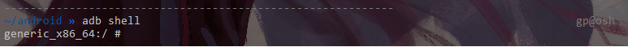

   * [Android Compile](#android-compile)
      * [Environment](#environment)
         * [Hardware](#hardware)
         * [Software](#software)
      * [Setting up build environment](#setting-up-build-environment)
         * [Requirements](#requirements)
      * [Download source codes](#download-source-codes)
         * [Install repo](#install-repo)
         * [Initialize repo client](#initialize-repo-client)
      * [Download the Android source tree](#download-the-android-source-tree)
      * [Choose Android Version](#choose-android-version)
      * [Compile](#compile)
         * [Initialize build env](#initialize-build-env)
         * [Select compilation target](#select-compilation-target)
         * [Build](#build)
      * [Run emulator](#run-emulator)
      * [Interaction](#interaction)


#	Android Compile

##	Environment

###	Hardware

* Cpu： Intel(R) Xeon(R) Platinum 8153 CPU @ 2.00GHz × 2
* Ram：126GB
* Disc：1TB SSD

###	Software

* System：Ubuntu 18.10
* Kernel：4.18.0-18-generic

## Setting up build environment

###	Requirements

1. 硬件要求

   - 如果是 Android 2.3.x (Gingerbread) 及更高版本（包括 master 分支），需要使用 64 位环境。如果是较低的版本，则可以在 32 位系统中进行编译。

   - 如果要检出代码，至少需要 250 GB 可用磁盘空间；如果要进行编译，则还需要 150 GB。如果要进行多次编译，则需要更多空间。

     ```shell
     注意：如果您要检出镜像，则需要更多空间，因为完整的 Android 开源项目 (AOSP) 镜像包含所有使用过的 Git 代码库。
     ```

   - 如果您在虚拟机中运行 Linux，则至少需要 16 GB 的 RAM/交换空间。

2. 软件要求

   我们选择的编译版本是Android9，所选择JDK的版本是 `OpenJDK 8`

   ```shell
   sudo apt install openjdk-8-jdk
   ```

3. 其他要求

   ```shell
   sudo apt-get install libx11-dev:i386 libreadline6-dev:i386 libgl1-mesa-dev g++-multilib 
   sudo apt-get install -y git flex bison gperf build-essential libncurses5-dev:i386 
   sudo apt-get install tofrodos python-markdown libxml2-utils xsltproc zlib1g-dev:i386 
   sudo apt-get install dpkg-dev libsdl1.2-dev libesd0-dev
   sudo apt-get install git-core gnupg flex bison gperf build-essential  
   sudo apt-get install zip curl zlib1g-dev gcc-multilib g++-multilib 
   sudo apt-get install libc6-dev-i386 
   sudo apt-get install lib32ncurses5-dev x11proto-core-dev libx11-dev 
   sudo apt-get install libgl1-mesa-dev libxml2-utils xsltproc unzip m4
   sudo apt-get install lib32z-dev ccache
   ```


##	Download source codes

由于众所周知的原因，官方源没法访问，所以我们选择清华源。

[谷歌教程](https://source.android.com/setup/build/downloading)

###	Install repo

```shell
mkdir ~/bin
PATH=~/bin:$PATH
#download repo
curl https://storage.googleapis.com/git-repo-downloads/repo > ~/bin/repo 
chmod a+x ~/bin/repo
```

###	Initialize repo client

配置Git

```shell
git config --global user.name "Your Name" 
git config --global user.email "you@example.com"
```

Repo init

```shell
mkdir source
cd source
repo init -u https://aosp.tuna.tsinghua.edu.cn/platform/manifest
```

要检出除 master 之外的其他分支，请使用 `-b` 指定此分支

```shell
repo init -u https://aosp.tuna.tsinghua.edu.cn/platform/manifest -b android-4.0.1_r1
```

##	Download the Android source tree

```shell
repo sync
```

这将下载全部的安卓代码


##	Choose Android Version

运用repo选择Android版本

查看可切换分支

```shell
cd .repo/manifests
git branch -a | cut -d / -f 3
```

切换分支

```shell
repo init -b BranchYouChoose 
repo sync (not needed if your local copy is up to date)
repo start BranchYouChoose  --all 
```

查看当前分支

```shell
repo branches
```

## Compile

###	Initialize build env

```shell
source ./build/envsetup.sh
```

###	Select compilation target

```shell
lunch
```

因为我们组没有实体机用于测试，所以编译x86版本安卓，用模拟器运行

```shell
lunch 22
```

### Build

```shell
m -j31
```


##	Run emulator

初始化环境

```shell
source build/envsetup.sh
lunch (选择刚才你编译的目标版本)
emulator
```

不过由于我们的机器没有显卡，cpu渲染图像能力低下 ，所以采用`-no-window`运行

```shell
emulator -no-window
```


##	Interaction

用adb工具代替GUI界面进行交互

```shell
adb devices #查找设备
adb connect ip:Port #连接设备
adb shell #启动shell
```



[More details about adb](<https://developer.android.com/studio/command-line/adb>)
