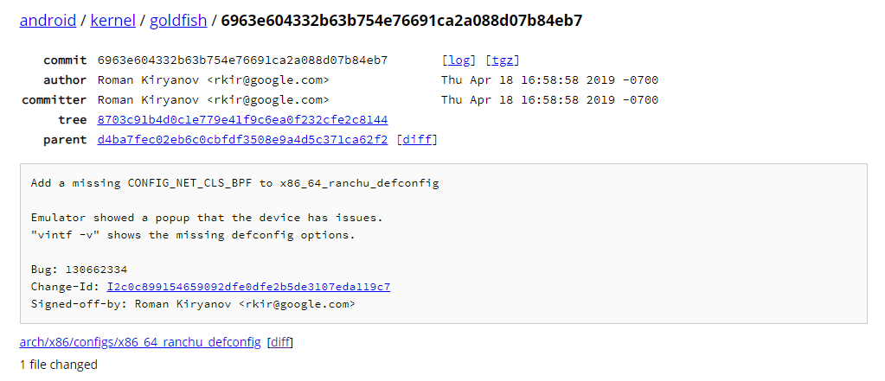

#	Customize Android kernel

默认的Android内核可能不支持某些功能，例如我们默认使用的内核 `4.4.112`不支持

[AF_ALG sockets]()，由此导致iproute2无法创建sockets，加载Xdp程序，为此我们需要定制我们的Android内核。

##	Detect availability of kernel's AF_ALG sockets

若在Android shell 用iproute2 加载 xdp 程序，若出现`No ELF library support compiled in`错误，则内核不支持 `AF_ALG sockets`

```shell
ip link set dev lo xdp obj xdp-example.o
```

也可尝试运行以下程序，检测是否支持AF_ALG

```c
#include <stdio.h>
#include <unistd.h>
#include <sys/types.h>
#include <sys/socket.h>
#include <linux/if_alg.h>

int main(){
    //Alternatively you can set the path to argv[1]
    FILE *f = fopen("/path/to/output/file", "w");
    if(f == NULL){
        //Handle error
    }
    int sockfd = socket(AF_ALG, SOCK_SEQPACKET, 0);
    if(sockfd == -1){
        if(errno == EAFNOSUPPORT){
            //Unavailable, put whatever you want here
            fprintf(f, "#define AF_ALG_UNAVAILABLE\n");
        } else {
            //Unable to detect for some other error
        }
    } else { //AF_ALG is available
        fprintf(f, "#define AF_ALG_AVAILABLE\n");
    }
    close(sockfd);
    fclose(f);
    return 0;
}
```

##	Find the special version of kernel we need

用于运行Android镜像的Android emulator对内核版本特别敏感，具体体现在

* 新kernel和默认kernel架构不同，则无法启动
* 新kernel和默认kernel版本不同，则无法启动
* 即使是同版本、同架构情况下，也不一定能启动

经过调查发现，必须找到默认kernel基于的build commit 版本建立新的内核，才能被Android emulator正常使用，所以先要找到我们所需的commit分支

1. 查看Android内核版本 

   启动Android shell

   ```shell
   generic_x86_64:/ # cat /proc/version
   Linux version 4.14.112+ (gp@osh) (gcc version 4.9.x 20150123 (prerelease) (GCC)) #8 SMP PREEMPT Thu Jul 4 16:15:11 UTC 2019
   ```

   对应的内核版本是`4.14.112`

2. 下载kernel

   ```shell
   git clone https://android.googlesource.com/kernel/goldfish
   ```

3. 查看分支

   ```shell
   $ git branch -a
   * (HEAD detached at 6963e604332b)
     android-4.14
     android-goldfish-4.14-dev
     master
     remotes/origin/HEAD -> origin/master
     remotes/origin/android-3.18
     remotes/origin/android-4.14
     remotes/origin/android-4.4
     remotes/origin/android-goldfish-2.6.29
     remotes/origin/android-goldfish-3.10
     remotes/origin/android-goldfish-3.10-k-dev
     remotes/origin/android-goldfish-3.10-l-mr1-dev
     remotes/origin/android-goldfish-3.10-m-dev
     remotes/origin/android-goldfish-3.10-n-dev
     remotes/origin/android-goldfish-3.18
     remotes/origin/android-goldfish-3.18-dev
     remotes/origin/android-goldfish-3.4
     remotes/origin/android-goldfish-3.4-l-mr1-dev
     remotes/origin/android-goldfish-4.14-dev
     remotes/origin/android-goldfish-4.14-dev.120914098
     remotes/origin/android-goldfish-4.14-dev.20190417
     remotes/origin/android-goldfish-4.14-dev.backup
     remotes/origin/android-goldfish-4.4-dev
     remotes/origin/android-goldfish-4.9-dev
     remotes/origin/b120914098
     remotes/origin/heads/for/android-goldfish-3.18-dev
     remotes/origin/linux-goldfish-3.0-wip
     remotes/origin/master
   ```

   Android 4.14的分支数目高达5个，为了确定具体是哪个分支的哪个commit是我们所需的，就必须翻阅官方的commit log

4. 查找对应的commit

   为了查找对应的commit，必须翻阅commit log 获得有用的信息

   我们所用的AOSP为默认master分支，其prebuilt kernel存放在`$ANDROID_TOP/prebuilt/qemu-kernel`中，可在[android/platform/prebuilts/qemu-kernel](https://android.googlesource.com/platform/prebuilts/qemu-kernel/)查询其commit log。

   经仔细排查，确定我们的所使用的内核为，其bug编号:130662334

   随后就可以去[android/kernel/goldfish](<https://android.googlesource.com/kernel/goldfish/>)各个分支查查阅log，通过Bug编号,确定具体分支，最终确定commit为4.14-dev branch 6963e60

   

   这里需要注意，即使都是4.14.112版本的内核，有些commit版本使用不正确的编译选项，也未必能被emulator接受，至少我们测试过程中只有这个版本内核编译结果可以启动emulator

5. 切换到对应分支
   ```shell
   git checkout android-goldfish-4.14-dev
   git checkout 6963e60
   ```

6. 编译

   随后就可以编译默认配置的android内核，使用AOSP prebuilt的中的build-kernel.sh [usage](https://android.googlesource.com/platform/external/qemu/+/refs/heads/master/docs/ANDROID-KERNEL.TXT)

   ```shell
   cd $KERNEL_TOP
   ./$ANDROID_TOP/prebuilts/qemu-kernel/build-kernel.sh --arch=x86_64_ranchu --out=.
   ```

7. 加载使用

   通过emulator -kernel参数进行加载，若能启动Android，则可以在此版本上开始定制我们的内核

   ```shell
   emulator -kernel new_kernel_path
   ```

##	Begin to customize our special Android kernel for Xdp

这里需要指出Android prebuilt kernel中只启用了非常有限的内核功能，其默认内核连ipv6都不支持

以x86_64架构为例，编译能够运行Xdp的内核只需

1. 生成默认.config

	```shell
	make menuconfig
	```

2. 加载Android默认配置

	```shell
	cp $KERNEL_TOP/arch/x86/configs/x86_64_ranchu_defconfig 		$KERNEL_TOP
	make menuconfig
	```

​	在menu中load `x86_64_ranchu_defconfig`

3. 设置Kernel编译选项

   对于我们的Android kernel来说只需启用AF_ALG，为此只需进入`Cryptographic API`打开

   * User-space interface for hash algorithms          
   * User-space interface for symmetric key cipher algorithms       
   * User-space interface for random number generator algorithms        
   * User-space interface for AEAD cipher algorithms    

   但需要指出的是，部分内核可能还需要设置相关网络和BPF编译选项才能，完整启用XDP程序，请根据内核配置而定

4. 编译新内核

   覆盖初始的编译选项

   ```shell
   #覆盖初始的Android 编译选项，推荐先进行备份
   cp $KERNEL_TOP/x86_64_ranchu_defconfig $KERNEL_TOP/arch/x86/configs/x86_64_ranchu_defconfig
   ```

   编译

   ```shell
   ./$ANDROID_TOP/prebuilts/qemu-kernel/build-kernel.sh --arch=x86_64_ranchu --out=.
   ```

   若编译过程出错，请确定Android SKD工具完整，并且编译选项没有冲突矛盾，部分编译失败情况可能由内核编译选项引起。

##	Try our unique custom kernel

使用emulator加载新内核，这里我们成功启用了AF_ALG sockets，使得iproute2可以加载Xdp程序。

```shell
emulator -kernel new_kernel_path
```


