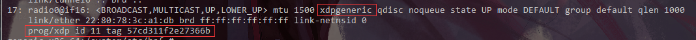
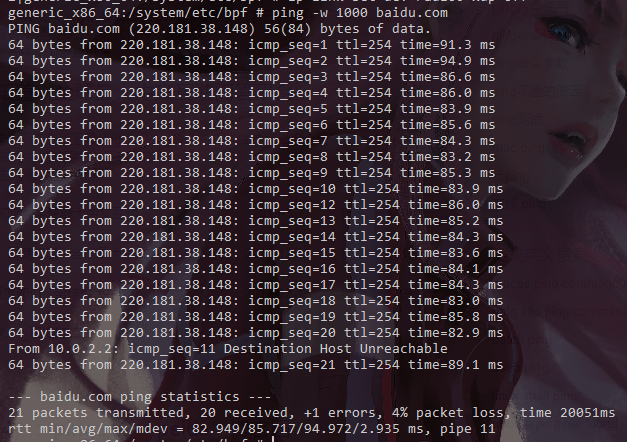

#	Run Xdp on Android

##	Requirement

* Successfully build Android source tree
* Write correct format XDP/BPF program 
  * Everything needs to be inlined, there are no function calls (on older LLVM versions) or shared library calls available.
  * Multiple programs can reside inside a single C file in different sections.
  * There are no global variables allowed.
  * There are no const strings or arrays allowed.
  * There are no loops available (yet).
  * Partitioning programs with tail calls.
  * Limited stack space of maximum 512 bytes.

##	Compile our Xdp program

确保已经建立起完善的Android环境

以非常简单的`xdp_drop.c`为例子，编译我们的XDP代码

```c
#include <linux/bpf.h>

#define SEC(NAME) __attribute__((section(NAME), used))

SEC("prog") //"prog" cannot loss which iproute2 use to find where the program begins
int xdp_drop(struct xdp_md *ctx)
{
    return XDP_DROP;
}

char _license[] SEC("license") = "GPL";
```

`xdp_drop`是一个简单的丢包程序，丢弃所有网络包。

由于Android提供了一套比较完整的BPF编译工具，借用这套工具可以将我们的XDP程序编译并放进镜像中。

###	How to compile

1. `mv xdp_drop.c $ANDROID_TOP/system/netd/bpf_prog`

2. `cd $ANDROID_TOP/system/netd/bpf_prog`

3. 修改`Android.bp`，添加程序的编译参数和链接，添加内容如下（在Android 9中，谷歌弃用Android.mk，全部使用了Android.bp)

   ```c
   /****************format***************/
   //bpf {
   //    name: "you_prog.o",
   //    srcs: ["you_prog.c"],
   //    cflags: [
   //        "-Wall",  //compile option
   //    ],
   //    include_dirs: [
   //        "BPF_PROG/include",
   //    ],
   //}
   /****************xdp_drop.c***********/
   bpf {
       name: "xdp_drop.o",
       srcs: ["xdp_drop.c"],
   }
   ```

4. 使用cmd  `mma` 开始编译，在编译前请确保设置好了Android相关环境，若出错，则有可能是你配套的Android环境未搭建完整。

   ```shell
   mma
   #若编译报错，极有可能是没有正确设置好Android环境，或者XDP/BPF程序本身有bug
   #编译成功，则会在$ANDROID_TOP/out/target/generic_your_target_arch/system/etc/bpf 中生成相应的`.o`文件
   ```

   Android环境设置

   ```shell
   source $ANDROID_TOP/build/envsetup.sh
   lunch your_target
   ```

5. 重新生成镜像

   ```shell
   cd $ANDROID_TOP
   m all
   #如果显示 no work to do，则运行
   #make snod 强制重新生成镜像文件
   ```

6. 此时运行模拟器和Android shell，能够在`/system/etc/bpf` 中看到生成的xdp_drop.o文件


###	Load Xdp program

Xdp程序加载有两种方法

1. 使用iproute2工具将Xdp程序加载到kernel中运行
2. 自己写相关的加载程序

上述两种方法都依赖于`libelf`这个C语言库，在Android中没有其支持，请确保正常移植并能使用该库，详细过程参考------------

> ELF object file access library
>
> 'Libelf' lets you read, modify or create ELF files in an architecture-independent way. The library takes care of size and endian issues, e.g. you can process a file for SPARC processors on an Intel-based system. This library is a clean-room rewrite of the System V Release 4 library and is supposed to be source code compatible with it. It was meant primarily for porting SVR4 applications to other operating systems but can also be used as the basis for new applications (and as a light-weight alternative to libbfd).

同时两种方法都依赖Android kernel 支持 AF_ALG sockets，请检测AF_ALG sockets是否可用，若不可用请参考定制Android内核，重新定制内核

####	Usage of 


####	Iproute2

加载xdp程序

```shell
ip link set dev em xdp obj xdp-example.o #xdp hook模式
ip link set dev em xdpgeneric obj xdp-exampe.o #SKB-mode
```

* 此处若出现`No ELF library support compiled in`错误，请参考`iproute2 定制`, 重新定制`iproute2`程序

* 此处若出现`Socket AF_ALG: Address family not support`，则是当前内核不支持该协议，请参考`rebuild Android kernel`，定制你的安卓内核

* 如执行成功，则再次执行`ip link`，则被绑定Xdp的网口，会显示`xdp`程序的字样。此时Xdp程序已经成功在内核中运行起来，你可根据Xdp程序功能进行测试

  

卸载xdp程序

```shell
ip link set dev em xdp off
```

##	Run Xdp

使用`ping`命令对xdp_drop进行测试

```shell
ping -w 1000 baidu.com
```

* 未挂在xdp_drop前



* 挂载xdp程序后

  

  这里由于测试之前ping baidu.con次数太多，baidu.com DNS解析出来的ip 地址已经被local缓存所以能够ping 出百度的ip地址。在之前的测试中，DNS解析都不可用

  

可见xdp_drop程序已经能在kernel中正确发挥作用

##	Debug

Android kernel中带有 BPF 相关的三个工具的源代码（`bpf_asm.c`、 `bpf_dbg.c`、 `bpf_jit_disasm.c`），根据版本不同，在 `$KERNEL_TOP/tools/net/`（直到 Linux 4.14）或者 `$KERNEL_TOP/tools/bpf/` 目录下面：

- `bpf_asm` 是一个极小的 cBPF 汇编程序。
- `bpf_dbg` 是一个很小的 cBPF 程序调试器。
- `bpf_jit_disasm` 对于两种 BPF 都是通用的，并且对于 JIT 调试来说非常有用。
- `bpftool` 是由 Jakub Kicinski 写的通用工具，它可以与 eBPF 程序交互并从用户空间的映射，例如，去展示、转储、pin 程序、或者去展示、创建、pin、更新、删除映射。

阅读在源文件顶部的注释可以得到一个它们使用方法的概述。

亦或者是使用marco print相关信息

> Helper functions such as `trace_printk()` can be worked around as follows:
>
> ```
> static void BPF_FUNC(trace_printk, const char *fmt, int fmt_size, ...);
> 
> #ifndef printk
> # define printk(fmt, ...)                                      \
>     ({                                                         \
>         char ____fmt[] = fmt;                                  \
>         trace_printk(____fmt, sizeof(____fmt), ##__VA_ARGS__); \
>     })
> #endif
> ```
>
> The program can then use the macro naturally like `printk("skb len:%u\n", skb->len);`. The output will then be written to the trace pipe. `tc exec bpf dbg` can be used to retrieve the messages from there.

[more details about bpf](https://cilium.readthedocs.io/en/v1.4/bpf/)

