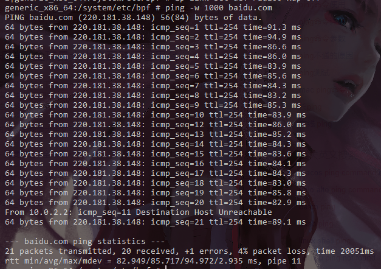

   * [Final Report](#final-report)
      * [1. Introduction](#1-introduction)
      * [2. Background](#2-background)
      * [3. cBPF/eBPF Architecture on Android](#3-cbpfebpf-architecture-on-android)
         * [3.1 Android BPF C   Wrapper](#31-android-bpf-c-wrapper)
            * [3.1.1 BpfMap](#311-bpfmap)
            * [3.1.2 Loader.cpp](#312-loadercpp)
         * [3.2 Compile and Run BPF Programs](#32-compile-and-run-bpf-programs)
         * [3.3 Difference between BPF on Android and Linux](#33-difference-between-bpf-on-android-and-linux)
      * [4. Development Efforts](#4-development-efforts)
         * [4.1 Build Android Source Tree](#41-build-android-source-tree)
            * [4.1.1 Environments](#411-environments)
            * [4.1.2 Dependencies](#412-dependencies)
            * [4.1.3 Download source codes](#413-download-source-codes)
            * [4.1.4 Compile](#414-compile)
            * [4.1.5 Run emulator](#415-run-emulator)
            * [4.1.6 Interaction](#416-interaction)
         * [4.2 Link iproute2 against libelf on Android](#42-link-iproute2-against-libelf-on-android)
            * [4.2.1 What's iproute2?](#421-whats-iproute2)
            * [4.2.2 Why we need iproute2?](#422-why-we-need-iproute2)
            * [4.2.3 Where did the difficulty reside?](#423-where-did-the-difficulty-reside)
            * [4.2.4 How we find and solve the problem step by step?](#424-how-we-find-and-solve-the-problem-step-by-step)
               * [Try #1: Add "-DHAVE_ELF" to cflags](#try-1-add--dhave_elf-to-cflags)
               * [Try #2: Link iproute2 against libelf by adding shared_libs](#try-2-link-iproute2-against-libelf-by-adding-shared_libs)
               * [Try #3: edit target property to link properly](#try-3-edit-target-property-to-link-properly)
               * [Try #4: edit visibility property to change visibility](#try-4-edit-visibility-property-to-change-visibility)
               * [Fix some minor bugs in Android source code](#fix-some-minor-bugs-in-android-source-code)
         * [4.3 Customize linux kernel](#43-customize-linux-kernel)
            * [4.3.1 Detect availability of kernel's AF_ALG sockets](#431-detect-availability-of-kernels-af_alg-sockets)
            * [4.3.2 Determine the specific Linux kernel version](#432-determine-the-specific-linux-kernel-version)
            * [4.3.3 Customize Linux kernel (of Android) for XDP](#433-customize-linux-kernel-of-android-for-xdp)
            * [4.3.4 Try our unique custom kernel](#434-try-our-unique-custom-kernel)
      * [5. Run XDP Programs (on Android)](#5-run-xdp-programs-on-android)
         * [5.1 Usage of this Project](#51-usage-of-this-project)
         * [5.2 Requirements](#52-requirements)
         * [5.3 Compile XDP programs](#53-compile-xdp-programs)
            * [5.3.1 How to compile](#531-how-to-compile)
            * [5.3.2 How to load](#532-how-to-load)
               * [Usage of iproute2](#usage-of-iproute2)
         * [5.4 Run XDP programs](#54-run-xdp-programs)
         * [5.5 Debug XDP programs](#55-debug-xdp-programs)
      * [6. Future works](#6-future-works)
      * [7. Outlook](#7-outlook)
      * [8. Division of Labour](#8-division-of-labour)
      * [9. Acknowledgement](#9-acknowledgement)
      * [10. Reference](#10-reference)
#	Final Report

##	1. Introduction

本项目旨在将XDP移植至安卓平台，并进一步通过XDP在安卓上实现网络处理相关的应用。

我们通过QEMU-KVM搭建了Android虚拟环境，解决了安卓环境下eBPF/XDP的库依赖问题，并运行了`SKB-mode`下的xdp程序。

##	2. Background

随着移动通信技术和移动互联网的发展，移动设备网络带宽得到显著提高，移动终端产生、处理越来越多的网络流量。作为移动终端的主力军，Android设备囿于基于OS kernel的传统网络数据包处理的弊端，高性能网络处理占用了大量的CPU资源，尤其是在CPU计算资源受限制的移动终端、物联网终端上。

 XDP是运行在linux内核中一个强大、可编程、高效的网络数据通路。它在提供高效的网络处理能力的同时，对CPU资源的占用较小。为以上问题提供了新的解决方案。

因此我们将XDP移植至android平台，为android平台提供高效的包处理工具。

## 3. cBPF/eBPF Architecture on Android

Android 上的 eBPF 的文档也十分不全面，基本上我们也是一边阅读 Android 中存在的 BPF 程序源码，一边读 Android BPF 的实现源码来搞懂的。

### 3.1 Android BPF C++ Wrapper

Android 自己在 BPF/eBPF 外面用 C++ 包了一层，提供了一些接口。这部分编译生成的库的名字叫做 `libbpf_android` ，可以在文件夹 `system/bpf/libbpf_android ` 中找到。比较重要的一个是定义了 `BpfMap`，它和底层的 bpf map 结构紧密相连，实际上就是提供了一个访问顶层 bpf map 的抽象 C++ OOP 接口，比较好用。关于对这部分的代码解释可以在我**阅读源码的[笔记](../notes/rtfs.md)**中找到。

以下是我们通过阅读源码记录的内容。

#### 3.1.1 BpfMap

BpfMap 定义在 `system/bpf/libbpf_android/include/bpf/BpfMap.h` 中（C++ Template 直接定义在头文件中）。它的构造函数定义如下：

```c++
BpfMap<Key, Value>() : mMapFd(-1){};
explicit BpfMap<Key, Value>(int fd) : mMapFd(fd){};
BpfMap<Key, Value>(bpf_map_type map_type, uint32_t max_entries, uint32_t map_flags) {
    int map_fd = createMap(map_type, sizeof(Key), sizeof(Value), max_entries, map_flags);
    if (map_fd < 0) {
        mMapFd.reset(-1);
    } else {
        mMapFd.reset(map_fd);
    }
}
```

它实际上是接受一个文件描述符（`mMapFd`），这个文件描述符通过 `bpf_obj_get` 得到，这个描述符的内容指向的是 `SEC("map")`（即BPF 程序 map section）中的 bpf map 底层数据结构。这个 BpfMap 提供了一个一致的接口，用于通过高级操作访问底层数据结构。

也可以通过 `.init` 来初始化，用法为：

```cp
mCookieTagMap.init(COOKIE_TAG_MAP_PATH)
```

其中 `COOKIE_TAG_MAP_PATH` 实际就是底层 bpf map 的路径，例如：

`./netd/libnetdbpf/include/netdbpf/bpf_shared.h: #define COOKIE_TAG_MAP_PATH BPF_PATH "/map_netd_cookie_tag_map"`。

#### 3.1.2 Loader.cpp

安卓上的 BpfLoader 定义在 `system/bpf/libbpf_android/Loader.cpp` 中，这里是安卓自己定义的 BPF 的加载工具。

首先可以看出，BPF 会被加载到 `/sys/fs/bpf` 中：

```c++
#define BPF_FS_PATH "/sys/fs/bpf/"
```

仔细阅读源码，可以发现，在加载函数的过程中，既可以自己调用函数，并给出各个 Section 的 BPF 程序类型属性等等，也可以选择由 Android 默认选择。Android 开机即加载 BPF 程序的功能就是通过默认选择实现的。默认对应关系为：

```c++
sectionType sectionNameTypes[] = {
    {"kprobe", BPF_PROG_TYPE_KPROBE},
    {"tracepoint", BPF_PROG_TYPE_TRACEPOINT},
    {"skfilter", BPF_PROG_TYPE_SOCKET_FILTER},
    {"cgroupskb", BPF_PROG_TYPE_CGROUP_SKB},
    {"schedcls", BPF_PROG_TYPE_SCHED_CLS},
    {"cgroupsock", BPF_PROG_TYPE_CGROUP_SOCK},

    /* End of table */
    {"END", BPF_PROG_TYPE_UNSPEC},
};
```

这里就不详细讲每个程序类别是做什么的了。

### 3.2 Compile and Run BPF Programs

为了将 bpf 程序编译入 Android，并运行起来，我们需要在某个地方写个 bpf 程序，例如 `bpf_example.c` ，然后在该模块中的 `Android.bp` （关于 `Android.bp` 的一些记录，可以看 [这里](../notes/Android_bp.md))，增添这样的内容:

```json
bpf {
    srcs: [
        "bpf_example.c",
    ],
    name: "bpf_example.o",
}
```

（bpf 属性，我们猜测，会指定这个程序的目标文件放到哪个文件夹，如何进行编译，增加一些额外的编译选项等内容。）

这样，程序会被编译到 `out/target/product/generic_x86_64/system/bpf/bpf_example.o` 中，这样，最后我们可以在运行 Android 的 /`system/bpf ` 中找到。值得一提的是，我们在使用 `m all` 或 `mma` 进行编译之后，需要在顶层目录输入 `make snod`，否则二进制文件可能不会打包到镜像中。`make snod` 的作用是重新打包生成 `system.img` 镜像。

置于确认此程序是否运行起来，可以看 `/sys/fs/bpf`。因为 bpf 会打开文件描述符，并将加载的程序放在那里。这和 linux 上的是一致的。

### 3.3 Difference between BPF on Android and Linux

Android 上的 BPF 有一些变化。

Android 上的 BPF 源文件中的每个函数需要放在特定 section 中，每个函数相当于一个 BPF 程序。可以通过在函数定义前添加 `SEC` 来实现。例如`SEC("skfilter/ingress/xtbpf")`.

- Android 上的 BPF 程序类型（`bpf_prog_type`）相对 linux 上的有限制，每个 BPF_PROG_TYPE 都需要用固定的 section 名字（关于这一点，我详细阅读了源码。源码中会根据 section 的名字推断出默认的程序类型，你也可以任意命名，但那样的话就只能用一些更低级的系统调用完成 Bpf 程序的加载，并需要自己指定程序类型）。分为 `kprobe`, `tracepoint`, `skfilter`, `schedcls`, `cgroupskb`, `cgroupsock`。分别对应：`BPF_PROG_TYPE_KPROBE`, `BPF_PROG_TYPE_TRACEPOINT`, `BPF_PROG_TYPE_SOCKETK_FILTER`, `BPF_PROG_TYPE_SCHED_CLS`, `BPF_PROG_TYPE_CGROUP_SKB`, `BPF_PROG_TYPE_CGROUP_SOCK`。我们需要在其中添加 `BPF_PROG_TYPE_XDP`。关于每种类型的程序提供的参数是什么，返回的结果应是什么，作用是什么，我们找到了这篇博客：[notes-on-bpf](<https://blogs.oracle.com/linux/notes-on-bpf-1>).

- 由于 BpfMap 经过了包装，同时 `Android` 又通过 `BpfUtils.cpp` 提供了一些工具函数，所以实际写的代码也会有所不同。比如定义 bpf map 时：

  可以通过这种方式定义 map：

  ```c
  struct bpf_map_def SEC("maps") iface_stats_map = {
      .type = BPF_MAP_TYPE_HASH,
      .key_size = sizeof(uint32_t),
      .value_size = sizeof(struct stats_value),
      .max_entries = IFACE_STATS_MAP_SIZE,
  };
  ```

  也可以：

  ```c
  DEFINE_BPF_MAP(name_of_my_map, ARRAY, int, uint32_t, 10);
  ```

  在代码中访问时，可以用 `android::bpf::BpfMap`。`BpfMap` 的构造函数接受一个文件描述符作为参数。安卓的 `bpfloader` 在加载 BPF 程序的过程中，会将 map 对应的 section 放在 `/sys/fs/bpf/map_name_of_map` 中，所以可以通过 `bpf_obj_get` 得到该路径对应的 bpf 对象，再将其传给 BpfMap，就能通过 BpfMap 的高级类方法访问底层数据结构。

##	4. Development Efforts

这一章节主要介绍：

1. 如何搭建Android环境
2. 如何解决Android libelf库依赖问题
3. 重新定制Android内核，启用部分功能

### 4.1 Build Android Source Tree

#### 4.1.1 Environments

* Hardware
  * Cpu： Intel(R) Xeon(R) Platinum 8153 CPU @ 2.00GHz × 2
  * Ram：126GB
  * Disc：1TB SSD

* Software
  * System：Ubuntu 18.10
  * Kernel：4.18.0-18-generic

#### 4.1.2 Dependencies

1. 硬件要求

   - 如果是 Android 2.3.x (Gingerbread) 及更高版本（包括 master 分支），需要使用 64 位环境。如果是较低的版本，则可以在 32 位系统中进行编译。

   - 如果要检出代码，至少需要 250 GB 可用磁盘空间；如果要进行编译，则还需要 150 GB。如果要进行多次编译，则需要更多空间。

     ```shell
     注意：如果您要检出镜像，则需要更多空间，因为完整的 Android 开源项目 (AOSP) 镜像包含所有使用过的 Git 代码库。
     ```

   - 如果您在虚拟机中运行 Linux，则至少需要 16 GB 的 RAM/交换空间。

2. 软件要求

   我们选择的编译版本是Android9，所选择JDK的版本是 `OpenJDK 8`

   ```shell
   sudo apt install openjdk-8-jdk
   ```

3. 其他要求

   ```shell
   sudo apt-get install libx11-dev:i386 libreadline6-dev:i386 libgl1-mesa-dev g++-multilib 
   sudo apt-get install -y git flex bison gperf build-essential libncurses5-dev:i386 
   sudo apt-get install tofrodos python-markdown libxml2-utils xsltproc zlib1g-dev:i386 
   sudo apt-get install dpkg-dev libsdl1.2-dev libesd0-dev
   sudo apt-get install git-core gnupg flex bison gperf build-essential  
   sudo apt-get install zip curl zlib1g-dev gcc-multilib g++-multilib 
   sudo apt-get install libc6-dev-i386 
   sudo apt-get install lib32ncurses5-dev x11proto-core-dev libx11-dev 
   sudo apt-get install libgl1-mesa-dev libxml2-utils xsltproc unzip m4
   sudo apt-get install lib32z-dev ccache
   ```

#### 4.1.3 Download source codes

由于众所周知的原因，官方源没法访问，所以我们选择清华源。

[谷歌教程](https://source.android.com/setup/build/downloading)

1. Install repo

	```shell
	mkdir ~/bin
	PATH=~/bin:$PATH
	#download repo
	curl https://storage.googleapis.com/git-repo-downloads/repo > 	~/bin/repo 
	chmod a+x ~/bin/repo
	```

2. Initialize repo client

	配置Git

	```shell
	git config --global user.name "Your Name" 
	git config --global user.email "you@example.com"
	```

3. Repo init

	```shell
	mkdir source
	cd source
	repo init -u https://aosp.tuna.tsinghua.edu.cn/platform/manifest
	```

	要检出除 master 之外的其他分支，请使用 `-b` 指定此分支

	```shell
	repo init -u https://aosp.tuna.tsinghua.edu.cn/platform/manifest -b 	android-4.0.1_r1
	```

4. Download the Android source tree

	```shell
	repo sync
	```

	这将下载全部的安卓代码

5. Choose Android Version

	运用repo选择Android版本
	查看可切换分支

	```shell
	cd .repo/manifests
	git branch -a | cut -d / -f 3
	```
	切换分支

	```shell
	repo init -b BranchYouChoose 
	repo sync (not needed if your local copy is up to date)
	repo start BranchYouChoose  --all 
	```
	查看当前分支
	
	```shell
	repo branch
	```


#### 4.1.4 Compile

1. Initialize build env

   ```shell
   source ./build/envsetup.sh
   ```

2. Select compilation target
	```shell
	lunch
	```
	因为我们组没有实体机用于测试，所以编译x86版本安卓，用模拟器运行
	```shell
	lunch 22
	```

3. Build

	```shell
	m -j31
	```

#### 4.1.5 Run emulator

初始化环境

```shell
source build/envsetup.sh
lunch (选择刚才你编译的目标版本)
emulator
```

不过由于我们的机器没有显卡，cpu渲染图像能力低下 ，所以采用`-no-window`运行

```shell
emulator -no-window
```


#### 4.1.6 Interaction

用adb工具代替GUI界面进行交互

```shell
adb devices #查找设备
adb connect ip:Port #连接设备
adb shell #启动shell
```


[More details about adb](<https://developer.android.com/studio/command-line/adb>)

### 4.2 Link iproute2 against libelf on Android

#### 4.2.1 What's iproute2?

> iproute2 is a collection of userspace utilities for controlling and monitoring various aspects of networking in the Linux kernel, including routing, network interfaces, tunnels, traffic control, and network-related device drivers.

总的来说，iproute2 管理着 linux 网络栈的方方面面。

#### 4.2.2 Why we need iproute2?

iproute2 提供了一些非常有用的工具，能够加载 XDP 程序，并将 XDP 程序挂到网卡上。我们选择它作为 Android 上 XDP 的作为工具链之一，主要是因为它部分存在于 Android 内核中。

#### 4.2.3 Where did the difficulty reside?

- Android 关于 soong 编译系统的文档实在少的可怜，我们不得不参考 Android 源码中已有的例子来猜测一些选项及属性的意思。这给我们的跨平台编译造成了很大困难和阻碍。因此我们做了一个 Android.bp 的笔记，你可以在[Android.bp笔记](../notes/Android_bp.md)找到它。
- Android 源码的代码结构不敢恭维。部分头文件和源文件被拷贝得到处都是，而且版本还不同。

#### 4.2.4 How we find and solve the problem step by step?

**HAVE_ELF**

在 Android 上完成 iproute2 是一个痛苦的过程。iproute2 的源码位于 `external/iproute2` 中。安卓中其实已经有 iproute2，但只包含了一些基础功能，部分功能以模块的形式存在。

在试错的过程中，我们使用 iproute2 加载 xdp 程序，报了一些错，我们在源码中找到对应的错误，发现最主要的是没有定义 `HAVE_ELF`。

`HAVE_ELF` 未定义的根源是，Android 没有链接 libelf 库，而 `HAVE_ELF` 则控制了一些函数的实现（指，有 libelf 的情况下功能如何实现，没有 libelf 的情况下功能如何实现，或者单纯只是报个错误）。

##### Try #1: Add "-DHAVE_ELF" to cflags

既然它说没有，那么我们就加上。我们在 `external/iproute2/Android.bp` 中加上如下内容：

```diff
cc_defaults {
    name: "iproute2_defaults",
    // --snippet--
    cflags: [
        // --snippet--
+       "-DHAVE_ELF",
    ]
}
```

之后输入 `mma` 进行编译。很自然的，我们得到了一些新的错误：**对未声明符号的引用**。我们搜索这些符号，发现这些函数都是 libelf 中的内容。

于是我们修改`external/iproute2/Android.bp`:

```diff
cc_defaults {
    // --snippet--
+   include_dirs: ["external/elfutils/libelf"],
}
```

这个选项的意思是很明显的。

之后我们又得到未定义引用的错误，和我们的预想情况相同，因为源码中当然会有很多对 libelf 中函数的引用，在加上 `-DHAVE_ELF` 后，这些引用重见天日，但由于我们还没有链接这个库，当然就出现了问题。因此下一步就是在 iproute2 的编译设置中链接 libelf。

**关于 libelf：**

> 'Libelf' lets you read, modify or create ELF files in an architecture-independent way. The library takes care of size and endian issues, e.g. you can process a file for SPARC processors on an Intel-based system.

总的来说，libelf 能够用来修改 ELF 程序。由于 BPF/eBPF 程序本质上是置于 ELF Section 中的一些字节码，所以 XDP 需要 libelf 来完成加载。这和是否使用 iproute2 无关，哪怕我们自己写加载 XDP 程序的工具，也需要用到 libelf。

因此下一步就是将 libelf 编译入 Android 内核中。

输入如下命令：

```shell
> grep "name: \"libelf\"" -r . --include=Android.bp 
```

很幸运地，我们在 `external/elfutils/` 中找到了 libelf 的某个版本。值得一提的是，`external/elfutils/Android.bp` 中的 Anroid.bp 有这样的内容：

```
subdirs = ["libelf"]
```

它表示只有 `libelf` 子目录下的内容会参与编译（详情请阅读[Android.bp笔记](../notes/Android_bp.md)。因此我们只需要考虑修改 `libelf` 里的内容。

#####	Try #2: Link iproute2 against libelf by adding `shared_libs`

同样也只是试错，我们直接修改 blueprints 文件添加 `shared_libs` 选项。

为了将 libelf 链接到 iproute2，我们首先修改 `/external/iproute2/Android.bp`:

```diff
cc_defaults {
    name: "iproute2_defaults",
    // --snippet--
+   shared_libs: [
+       "libbpf",
+   ]
}
```

这样将 libelf 动态链接入 iproute2 的所有库中。得到了一些 soong 的模块间链接错误：

```
error: external/iproute2/misc/Android.bp:1:1: dependency "libelf" of "..." missing available variant:
arch:android_x86_64, link:shared
available variants:
arch:android_x86_64, link:static, image:core
arch:android_x86, link:shared, image:core
arch:android_x86, link:static, image:core
arch:linux_x86_64, link:shared, image:core
arch:linux_x86_64, link:shared, image:core
...
error: external/iproute2/tc/Android.bp:1:1: dependency "libelf" of "..." missing variant
available
arch:android_x86_64, link:shared
...
```

我们发现有许多模块都突然添加了对 libelf 的依赖。于是阅读了 iproute2 几个子目录的 Android.bp 文件，发现子目录中将顶层目录的配置通过 `defaults` 属性默认地包含了进来。例如：

```
cc_library_shared {
    name: "libiprouteutil",
    defaults: ["iproute2_defaults"],
}
```

这种情况下，我们仔细考察了编译依赖关系，确认只有 `externals/iproute2/lib` 中的 `libiprouteutil` 对 libelf 有依赖关系。因此将 shared_libs 从 `/external/iproute2/Android.bp` 中删除，而只修改 `/external/iproute2/lib/Android.bp` 的内容：

```diff
cc_defaults {
    name: "libiprouteutil",
    // --snippet--
+   shared_libs: [
+       "libbpf",
+   ]
}
```

同时我们观察到只缺少变体 `android_x86_64_shared` ，其它变体都有。下一步我们将进一步阅读和修改 Android.bp 文件。

##### Try #3: edit `target` property to link properly

考察 `external/elfutils/libelf/Android.bp` 的内容：

```
    target: {
        darwin: {
            enabled: false,
        },
        android: {
            cflags: [
                "-D_FILE_OFFSET_BITS=64",
                "-include AndroidFixup.h",
            ],
            shared: {
                enabled: false,
            },
        },
    },

```

发现有一个属性 `target.android.shared.enabled` 被设置成了 false。我们猜测它控制了 Android 目标架构下动态链接库的生成。之后我们在生成的目标文件夹中进行确认，发现确实只有 `libelf.a` 而没有 `libelf.so`，因此肯定了我们的猜测。

再次进行试错，我们修改 `external/elfutils/libelf/Android.bp` 的内容：

```diff
cc_library {
    // --snippet--
    target: {
        darwin: {
            enabled: false,
        },
        android: {
            cflags: [
                "-D_FILE_OFFSET_BITS=64",
                "-include AndroidFixup.h",
            ],
            shared: {
-               enabled: false,
+               enabled: true,
            },
        },
    },
}
```

得到了一大堆错误。这也和我们预测的一致——它在 Android 架构下不编译成动态库肯定是有原因的，可能是一些依赖和这个库的可移植性的问题，我们不考虑解决这些问题，而决定换一条路。

我们修改 `external/iproute2/lib/Android.bp` （注意文件夹和之前的不同）的内容：

```diff
cc_library_shared {
    // --snippet--
-   shared_libs: [
-       "libelf",
-   ],
+   target: {
+       android: {
+           cflags: ["-DAndroid"],
+           static_libs: ["libelf"],
+	    },
+       host: {
+           shared_libs: ["libelf"],
+       },
+   },
}
```

这样做的意思是，在 android 架构下通过静态链接链接 libelf，在 host 架构下通过动态链接链接 libelf。这样做之后我们得到了新的报错：

```
module 'libiprouteutil' variant 'android_x86_64_static': depends on 'libelf' which is not visible to this module
```

在解决这个报错的过程中我们走了许多歪路，就不提了。下面直接描述正确的做法：

##### Try #4: edit `visibility` property to change visibility

我们一直忽视的一个属性是 `visibility`（主要是 Android.bp 的文档实在是不全，`visibility` 又很少用到）。我们最后在 `external/elfutils/libelf/Android.bp` 中看到了 `visibility` 这个属性，推测应该就是这个属性和我们最后一个报错相关：

```diff
cc_library {
    visibility: [
        "//device/google/contexthub/util/nanoapp_postprocess",
        "//external/mesa3d",
        "//external/perf_data_converter",
+       "//external/iproute2/lib",
    ],
}
```

一切解决。

##### Fix some minor bugs in Android source code

值得一提的是，Android 的 iproute2 源码中有一些小 bug。在链接了 libelf 后，这些 bug 由于 `-DHAVE_ELF` 的定义暴露了出来。大概 Android 的开发者由于并没有考虑链接这两者，所以也没有进行代码测试吧。我们修改了这些小 bug，最后 iproute2 正常运行。 

### 4.3 Customize linux kernel

Android 上的 linux 内核是预编译进去的。

默认的Android内核可能不支持某些功能，例如我们默认使用的内核 `4.4.112`不支持 [AF_ALG sockets](http://man7.org/linux/man-pages/man2/socket.2.html)，由此导致iproute2无法创建sockets，加载XDP 程序，为此我们需要定制我们的Android内核。

我们基于 Android 的 Goldfish Linux 内核，裁减了我们自己的 Linux 内核。

#### 4.3.1 Detect availability of kernel's AF_ALG sockets

若在Android shell 用iproute2 加载 xdp 程序，若出现`No ELF library support compiled in`错误，则内核不支持 `AF_ALG sockets`

```shell
ip link set dev lo xdp obj xdp-example.o
```

也可尝试运行以下程序，检测是否支持AF_ALG

```c
#include <stdio.h>
#include <unistd.h>
#include <sys/types.h>
#include <sys/socket.h>
#include <linux/if_alg.h>

int main(){
    //Alternatively you can set the path to argv[1]
    FILE *f = fopen("/path/to/output/file", "w");
    if(f == NULL){
        //Handle error
    }
    int sockfd = socket(AF_ALG, SOCK_SEQPACKET, 0);
    if(sockfd == -1){
        if(errno == EAFNOSUPPORT){
            //Unavailable, put whatever you want here
            fprintf(f, "#define AF_ALG_UNAVAILABLE\n");
        } else {
            //Unable to detect for some other error
        }
    } else { //AF_ALG is available
        fprintf(f, "#define AF_ALG_AVAILABLE\n");
    }
    close(sockfd);
    fclose(f);
    return 0;
}
```

#### 4.3.2 Determine the specific Linux kernel version

用于运行Android镜像的Android emulator对内核版本特别敏感，具体体现在

- 新kernel和默认kernel架构不同，则无法启动
- 新kernel和默认kernel版本不同，则无法启动
- 即使是同版本、同架构情况下，也不一定能启动

经过调查发现，必须找到默认kernel基于的build commit 版本建立新的内核，才能被Android emulator正常使用，所以先要找到我们所需的commit分支

1. 查看Android内核版本 

   启动Android shell

   ```shell
   generic_x86_64:/ # cat /proc/version
   Linux version 4.14.112+ (gp@osh) (gcc version 4.9.x 20150123 (prerelease) (GCC)) #8 SMP PREEMPT Thu Jul 4 16:15:11 UTC 2019
   ```

   对应的内核版本是`4.14.112`

2. 下载kernel

   ```shell
   git clone https://android.googlesource.com/kernel/goldfish
   ```

3. 查看分支

   ```shell
   $ git branch -a
   * (HEAD detached at 6963e604332b)
     android-4.14
     android-goldfish-4.14-dev
     master
     remotes/origin/HEAD -> origin/master
     remotes/origin/android-3.18
     remotes/origin/android-4.14
     remotes/origin/android-4.4
     remotes/origin/android-goldfish-2.6.29
     remotes/origin/android-goldfish-3.10
     remotes/origin/android-goldfish-3.10-k-dev
     remotes/origin/android-goldfish-3.10-l-mr1-dev
     remotes/origin/android-goldfish-3.10-m-dev
     remotes/origin/android-goldfish-3.10-n-dev
     remotes/origin/android-goldfish-3.18
     remotes/origin/android-goldfish-3.18-dev
     remotes/origin/android-goldfish-3.4
     remotes/origin/android-goldfish-3.4-l-mr1-dev
     remotes/origin/android-goldfish-4.14-dev
     remotes/origin/android-goldfish-4.14-dev.120914098
     remotes/origin/android-goldfish-4.14-dev.20190417
     remotes/origin/android-goldfish-4.14-dev.backup
     remotes/origin/android-goldfish-4.4-dev
     remotes/origin/android-goldfish-4.9-dev
     remotes/origin/b120914098
     remotes/origin/heads/for/android-goldfish-3.18-dev
     remotes/origin/linux-goldfish-3.0-wip
     remotes/origin/master
   ```

   Android 4.14的分支数目高达5个，为了确定具体是哪个分支的哪个commit是我们所需的，就必须翻阅官方的commit log

4. 查找对应的commit

   为了查找对应的commit，必须翻阅commit log 获得有用的信息

   我们所用的AOSP为默认master分支，其prebuilt kernel存放在`$ANDROID_TOP/prebuilt/qemu-kernel`中，可在[android/platform/prebuilts/qemu-kernel](https://android.googlesource.com/platform/prebuilts/qemu-kernel/)查询其commit log。

   经仔细排查，确定我们的所使用的内核为，其bug编号:130662334

   随后就可以去[android/kernel/goldfish](<https://android.googlesource.com/kernel/goldfish/>)各个分支查查阅log，通过Bug编号,确定具体分支，最终确定commit为4.14-dev branch 6963e60

   

   这里需要注意，即使都是4.14.112版本的内核，有些commit版本使用不正确的编译选项，也未必能被emulator接受，至少我们测试过程中只有这个版本内核编译结果可以启动emulator

5. 切换到对应分支

   ```shell
   git checkout android-goldfish-4.14-dev
   git checkout 6963e60
   ```

6. 编译

   随后就可以编译默认配置的android内核，使用AOSP prebuilt的中的build-kernel.sh [usage](https://android.googlesource.com/platform/external/qemu/+/refs/heads/master/docs/ANDROID-KERNEL.TXT)

   ```shell
   cd $KERNEL_TOP
   ./$ANDROID_TOP/prebuilts/qemu-kernel/build-kernel.sh --arch=x86_64 --config=x86_64_ranchu --out=.
   ```

7. 加载使用

   通过emulator -kernel参数进行加载，若能启动Android，则可以在此版本上开始定制我们的内核

   ```shell
   emulator -kernel new_kernel_path
   ```

#### 4.3.3 Customize Linux kernel (of Android) for XDP

这里需要指出Android prebuilt kernel中只启用了非常有限的内核功能，其默认内核连ipv6都不支持

以x86_64架构为例，编译能够运行Xdp的内核只需

1. 生成默认.config

   ```shell
   make menuconfig
   ```

2. 加载Android默认配置

   ```shell
   cp $KERNEL_TOP/arch/x86/configs/x86_64_ranchu_defconfig 		$KERNEL_TOP
   make menuconfig
   ```

   在menu中load `x86_64_ranchu_defconfig`

3. 设置Kernel编译选项

   对于我们的Android kernel来说只需启用AF_ALG，为此只需进入`Cryptographic API`打开

   - User-space interface for hash algorithms          
   - User-space interface for symmetric key cipher algorithms       
   - User-space interface for random number generator algorithms        
   - User-space interface for AEAD cipher algorithms    

   但需要指出的是，部分内核可能还需要设置相关网络和BPF编译选项才能，完整启用XDP程序，请根据内核配置而定

4. 编译新内核

   覆盖初始的编译选项

   ```shell
   #覆盖初始的Android 编译选项，推荐先进行备份
   cp $KERNEL_TOP/x86_64_ranchu_defconfig $KERNEL_TOP/arch/x86/configs/x86_64_ranchu_defconfig
   ```

   编译

   ```shell
   ./$ANDROID_TOP/prebuilts/qemu-kernel/build-kernel.sh --arch=x86_64 -config=x86_64_ranchu --out=.
   ```

   若编译过程出错，请确定Android SKD工具完整，并且编译选项没有冲突矛盾，部分编译失败情况可能由内核编译选项引起。

#### 4.3.4 Try our unique custom kernel

使用emulator加载新内核，这里我们成功启用了AF_ALG sockets，使得	iproute2可以加载Xdp程序。

```shell
emulator -kernel ${new_kernel_path}
```

## 5. Run XDP Programs (on Android)

### 5.1 Usage of this Project

使用我们这个项目即可在 Android 上编译，加载并运行 XDP 程序。你只需要下载我们 `src/` 目录下的 elfutils 和 iproute2 子模块，并覆盖 Android 源码中对应的部分 `external/elfutils` 和 `external/iproute2` 即可。

```bash
git clone https://github.com/OSH-2019/x-xdp-on-android
cd x-xdp-on-android
git submodule init
git submodule update --remote
mv elfutils ${android_root}/external/elfutils -r && mv iproute2 ${android_root}/external/iproute2 -r
```

并使用我们提供的 `src/.config` 文件编译 linux 内核，并在启动模拟器时输入加上如下选项：

```bash
emulator -no-window -kernel ${path_to_linux_kernel}
```

### 5.2 Requirements

- Successfully build Android source tree
- Write correct format XDP/BPF program 
  - Everything needs to be inlined, there are no function calls (on older LLVM versions) or shared library calls available.
  - Multiple programs can reside inside a single C file in different sections.
  - There are no global variables allowed.
  - There are no const strings or arrays allowed.
  - There are no loops available (yet).
  - Partitioning programs with tail calls.
  - Limited stack space of maximum 512 bytes.

### 5.3 Compile XDP programs

确保已经建立起完善的Android环境

以非常简单的`xdp_drop.c`为例子，编译我们的XDP代码

```c
#include <linux/bpf.h>

#define SEC(NAME) __attribute__((section(NAME), used))

SEC("prog") //"prog" cannot loss which iproute2 use to find where the program begins
int xdp_drop(struct xdp_md *ctx)
{
    return XDP_DROP;
}

char _license[] SEC("license") = "GPL";
```

`xdp_drop`是一个简单的丢包程序，丢弃所有网络包。

由于Android提供了一套比较完整的BPF编译工具，借用这套工具可以将我们的XDP程序编译并放进镜像中。

#### 5.3.1 How to compile

1. `mv xdp_drop.c $ANDROID_TOP/system/netd/bpf_prog`

2. `cd $ANDROID_TOP/system/netd/bpf_prog`

3. 修改`Android.bp`，添加程序的编译参数和链接，添加内容如下（在Android 9中，谷歌弃用Android.mk，全部使用了Android.bp)

   ```c
   /****************format***************/
   //bpf {
   //    name: "you_prog.o",
   //    srcs: ["you_prog.c"],
   //    cflags: [
   //        "-Wall",  //compile option
   //    ],
   //    include_dirs: [
   //        "BPF_PROG/include",
   //    ],
   //}
   /****************xdp_drop.c***********/
   bpf {
       name: "xdp_drop.o",
       srcs: ["xdp_drop.c"],
   }
   ```

4. 使用cmd  `mma` 开始编译，在编译前请确保设置好了Android相关环境，若出错，则有可能是你配套的Android环境未搭建完整。

   ```shell
   mma
   #若编译报错，极有可能是没有正确设置好Android环境，或者XDP/BPF程序本身有bug
   #编译成功，则会在$ANDROID_TOP/out/target/generic_your_target_arch/system/etc/bpf 中生成相应的`.o`文件
   ```

   Android环境设置

   ```shell
   source $ANDROID_TOP/build/envsetup.sh
   lunch your_target
   ```

5. 重新生成镜像

   ```shell
   cd $ANDROID_TOP
   m all
   #如果显示 no work to do，则运行
   #make snod 强制重新生成镜像文件
   ```

6. 此时运行模拟器和Android shell，能够在`/system/etc/bpf` 中看到生成的xdp_drop.o文件

#### 5.3.2 How to load

Xdp程序加载有两种方法

1. 使用iproute2工具将Xdp程序加载到kernel中运行
2. 自己写相关的加载程序

上述两种方法都依赖于`libelf`这个C语言库，在Android中没有其支持，请确保正常移植并能使用该库     [solve_link](#424-how-we-find-and-solve-the-problem-step-by-step)

> ELF object file access library
>
> 'Libelf' lets you read, modify or create ELF files in an architecture-independent way. The library takes care of size and endian issues, e.g. you can process a file for SPARC processors on an Intel-based system. This library is a clean-room rewrite of the System V Release 4 library and is supposed to be source code compatible with it. It was meant primarily for porting SVR4 applications to other operating systems but can also be used as the basis for new applications (and as a light-weight alternative to libbfd).

同时两种方法都依赖Android kernel 支持 AF_ALG sockets，请 [检测AF_ALG sockets](#431-detect-availability-of-kernel's-AF_ALG-sockets) 是否可用，若不可用请参考 [定制Android内核](#43-customize-linux-kernel) ，重新定制内核

##### Usage of iproute2

加载xdp程序

```shell
ip link set dev em xdp obj xdp-example.o #xdp hook模式
ip link set dev em xdpgeneric obj xdp-exampe.o #SKB-mode
```

- 此处若出现`No ELF library support compiled in`错误，请参考 [iproute2 定制](#42-Link-iproute2-against-libelf-on-Android) , 重新定制`iproute2`程序

- 此处若出现`Socket AF_ALG: Address family not support`，则是当前内核不支持该协议，请参考 [rebuild Android kernel](#43-customize-linux-kernel) ，定制你的安卓内核

- 如执行成功，则再次执行`ip link`，则被绑定Xdp的网口，会显示`xdp`程序的字样。此时Xdp程序已经成功在内核中运行起来，你可根据Xdp程序功能进行测试

  

卸载xdp程序

```shell
ip link set dev em xdp off
```

### 5.4 Run XDP programs

使用`ping`命令对xdp_drop进行测试

```shell
ping -w 1000 baidu.com
```

- 未挂载xdp_drop前

  

- 挂载xdp程序后

  

  这里由于测试之前ping baidu.con次数太多，baidu.com DNS解析出来的ip 地址已经被local缓存所以能够ping 出百度的ip地址。在之前的测试中，DNS解析都不可用

  

可见xdp_drop程序已经能在kernel中正确发挥作用

[简单的性能测试](LoadAndTest.md)

### 5.5 Debug XDP programs

Android kernel中带有 BPF 相关的三个工具的源代码（`bpf_asm.c`、 `bpf_dbg.c`、 `bpf_jit_disasm.c`），根据版本不同，在 `$KERNEL_TOP/tools/net/`（直到 Linux 4.14）或者 `$KERNEL_TOP/tools/bpf/` 目录下面：

- `bpf_asm` 是一个极小的 cBPF 汇编程序。
- `bpf_dbg` 是一个很小的 cBPF 程序调试器。
- `bpf_jit_disasm` 对于两种 BPF 都是通用的，并且对于 JIT 调试来说非常有用。
- `bpftool` 是由 Jakub Kicinski 写的通用工具，它可以与 eBPF 程序交互并从用户空间的映射，例如，去展示、转储、pin 程序、或者去展示、创建、pin、更新、删除映射。

阅读在源文件顶部的注释可以得到一个它们使用方法的概述。

亦或者是使用marco print相关信息

> Helper functions such as `trace_printk()` can be worked around as follows:
>
> ```
> static void BPF_FUNC(trace_printk, const char *fmt, int fmt_size, ...);
> 
> #ifndef printk
> # define printk(fmt, ...)                                      \
>  ({                                                         \
>      char ____fmt[] = fmt;                                  \
>      trace_printk(____fmt, sizeof(____fmt), ##__VA_ARGS__); \
>  })
> #endif
> 
> ```
>
> The program can then use the macro naturally like `printk("skb len:%u\n", skb->len);`. The output will then be written to the trace pipe. `tc exec bpf dbg` can be used to retrieve the messages from there.

[more details about bpf](https://cilium.readthedocs.io/en/v1.4/bpf/)

##	6. Future works

本项目基本完成了预定任务，但是仍然有美中不足的地方。由于Android对XDP的驱动支持还是一片空白，本项目是基于SKB-mode模式完成的。囿于本组组员对Android驱动开发不够熟悉、linux kernel理解不够深入和Android部分网卡驱动不开源的特殊性，在本学期内无法完成支持XDP的网卡驱动移植。如果后续还有机会，将会尝试移植支持XDP的网卡驱动至安卓上，实现XDP程序的满血版。

##	7. Outlook

在本项目的研究、移植过程中，还有以下发现：

1. Android 虽然支持eBPF扩展，但其不够灵活多变，只能在开机的情况下自动加载BPF程序，一直运行直到设备关机，并且目前仅执行一些较为简单的任务，诸如流量监控，设备功率预测等
2. 目前Android BPF程序执行过程没有针对性

而我们所移植的XDP，可以很好的解决上述问题，提供高效可靠灵活、支持动态加载、具有针对性和泛化性的网络编程方案。依据XDP用户空间和内核空间互动的特点，可以将其应用在诸如流量转发、隐私保护 、网络防火墙等诸多领域，在提高Android设备网络性能以适应5G时代的同时，为Android设备广大开发者提供除应用开发、驱动移植之外的另一个选择——高性能网络编程

## 8. Division of Labour

龚平（组长）和魏剑宇主要负责技术方面的工作。龚平除了给予项目指导工作，指挥分工，确认方向外，还搭建了 Android 的开发环境，根据项目的需要定制、裁剪和测试了 linux 内核，并实际挂载、运行和测试了 Android 上的 XDP 程序。魏剑宇主要负责代码方面的工作，他通过阅读 Android 的源码，弄清 Android 上 BPF 的架构，和 Android 的 soong 编译系统，实际修改 Android.bp 文件和库源码，完成了库移植、链接和 XDP 工具链的完善。

Android 上 XDP 的移植并不是一个技术上非常困难的工作，但由于 Android 源码规模过大，文档不充分，我们对 BPF XDP技术并不是特别了解，所以调研、确定方向就特别重要。黄展翔、罗极羽和王怡萱主要负责了前期调研，确定方向，通过广泛阅读各类文档，为我们的项目提供了知识储备，并负责了 linux 和 android 平台上的实验，测试和探究工作。其中，黄展翔和罗极羽同学调研了 BPF 和 XDP 的差别，并在 linux 上测试了 一些 XDP 程序的运行，为我们提供了方向。其中罗极羽负责的一个防 ddos 程序也被我们后期移植到了 Android 上，用于 XDP 的测试。王怡萱调研了 Android 上的 eBPF 程序的一般化编写方式，并实际考察了 Android 上的流量监控程序，同时她还是我们组的主力 ppt 工程师。

##	9. Acknowledgement

邢凯老师为我们提供了将xdp移植到android这一方向，并为我们评估了驱动方面的难度，在我们项目遇到困境时给予我们极大的鼓励。

何纪言助教为我们的移植工作提供了方向性指导，并在工程方面提供了很多切实的建议。

在此本小组成员一并感谢。

## 10. Reference

- [notes on bpf](<https://blogs.oracle.com/linux/notes-on-bpf-1>)
- [Android dependency build error](<https://www.jianshu.com/p/f239e919352a>)
- [soong readme](<https://android.googlesource.com/platform/build/soong/+/master/README.md>)
- [Android Source](<https://android.googlesource.com/>)
- [Android BPF](<https://source.android.com/devices/architecture/kernel/bpf>)
- [elfutils/libelf](<https://sourceware.org/elfutils/>)
- [wiki: iproute2](<https://en.wikipedia.org/wiki/Iproute2>)
