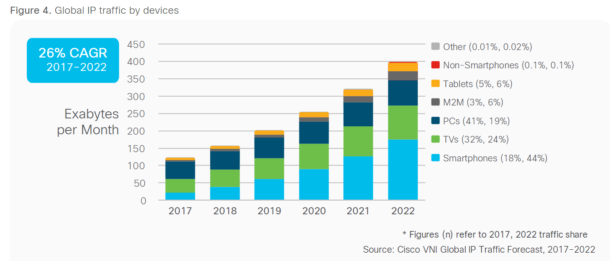
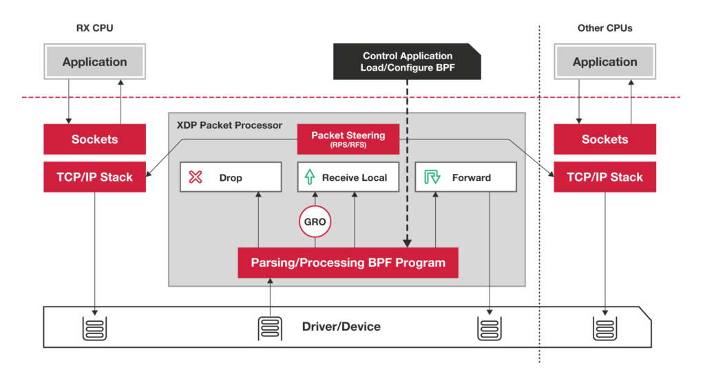
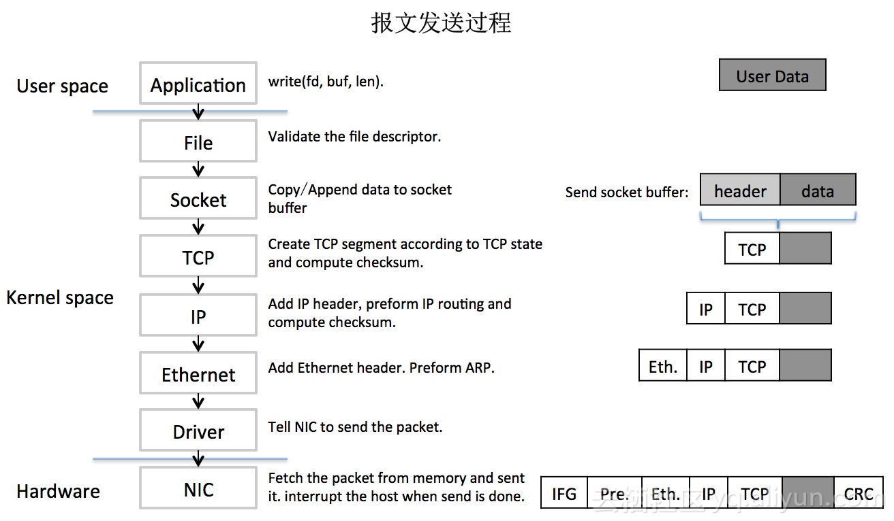
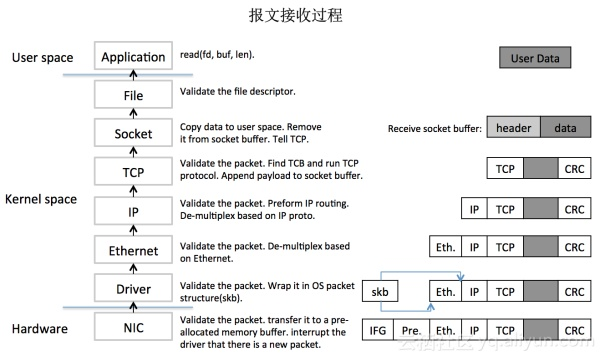
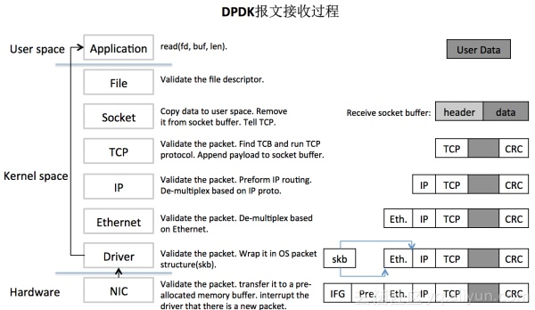

[TOC]

#	项目简介

随着移动通信技术和移动互联网的发展，移动设备网络带宽得到显著提高，移动手机产生、处理越来越多的网络流量，囿于基于OS kernel的传统网络数据包处理的弊端，高性能网络处理占用了大量的CPU资源，尤其是在CPU计算资源受限制的移动设备上。本项目旨在为android移动设备搭建一个高效的XDP应用开发平台，为android提供一个高性能、可编程的网络数据通路。

# 项目背景

## 基于OS内核的传统数据传输的弊端

如下，是 linux 的网络架构。


- System call interface：这个为应用程序获取内核的网络系统提供了接口。
- Protocol agnostic interface：为和各种传输层协议的网络交互提供的一层公共接口。
- Network protocals：对各种传输层协议的实现，如TCP、UDP、IP等。
- Device agnostic interface：为各种底层网络设备抽象出的公共接口。
- Device drivers：与各种网络设备交互的驱动实现。

从上可以看出，linux的网络架构经过了层层抽象，在为开发带来便利的同时也将带来一定程度上的低效率。

其主要弊端体现在：

1. **中断处理。**当网络中大量数据包到来时，会产生频繁的硬件中断请求，这些硬件中断可以打断之前较低优先级的软中断或者系统调用的执行过程，如果这种打断频繁的话，将会产生较高的性能开销。
2. **内存拷贝。**正常情况下，一个网络数据包从网卡到应用程序需要经过如下的过程：数据从网卡通过 DMA 等方式传到内核开辟的缓冲区，然后从内核空间拷贝到用户态空间，在 Linux 内核协议栈中，这个耗时操作甚至占到了数据包整个处理流程的 57.1%。
3. **上下文切换。**频繁到达的硬件中断和软中断都可能随时抢占系统调用的运行，这会产生大量的上下文切换开销。另外，在基于多线程的服务器设计框架中，线程间的调度也会产生频繁的上下文切换开销，同样，锁竞争的耗能也是一个非常严重的问题。
4. **局部性失效。**如今主流的处理器都是多个核心的，这意味着一个数据包的处理可能跨多个 CPU 核心，比如一个数据包可能中断在 cpu0，内核态处理在 cpu1，用户态处理在 cpu2，这样跨多个核心，容易造成 CPU 缓存失效，造成局部性失效。如果是 NUMA 架构，更会造成跨 NUMA 访问内存，性能受到很大影响。
5. **内存管理。**传统服务器内存页为 4K，为了提高内存的访问速度，避免 cache miss，可以增加 cache 中映射表的条目，但这又会影响 CPU 的检索效率。


## 移动设备将贡献越来越多的网络流量

在全球范围内，在网设备数目将会继续飞速增长，智能手机，物联网设备等保有量都会有巨大的提高。


同时，IP流量在近几年持续高速增长，达到26%的复合年增长率，智能手机等移动设备将会贡献越来越多的网络流量。单台设备将会处理更多的网路数据包，这对基于OS kernel的传统数据传输的Android设备带来一定挑战。




## eBPF/XDP技术

### 简介

BPF：柏克莱封包过滤器，是数据链路层的一种原始接口，提供原始链路层封包的收发，还可以对驱动支持洪泛模式的网卡处于此种模式，以收到网络上的所有包。

它提供一种过滤包的方法，并且避免从内核空间到用户空间的无用的数据包复制行为。

BPF最初由从用户空间注入到内核的一个简单的字节码构成，它在此利用一个校验器进行检查——以避免内核崩溃或者安全问题——并附着在一个套接字上，并在每个接收到的包上运行。

**BPF的两大核心功能：**

- 过滤（Filter）：根据外界输入的规则过滤报文；
- 复制（Copy）：将符合条件的报文由内核空间复制到用户空间；

基于BPF的全新设计的eBPF，一方面，eBPF在内核追踪（Kernel Tracing），应用性能调优调控等领域有了较大的变革；另一方面，在接口的设计和易用性上，eBPF也有了较大改进。他还应用于网络编程领域，以一种高效的方式执行各种包处理任务。

### XDP

不同于传统linux内核对报文的低效率处理，XDP在linux网络栈中加了新的一层，在报文到达CPU的最早时刻进行处理，甚至避免了`skb`的分配，从而减少了内存拷贝上的负荷。



XDP通过eBPF提供了一套十分灵活的可编程解决方案。它将可编程性直接植入操作系统的网络栈中。XDP在运行过程中，不需要对网络进行任何操作，而可以直接替换XDP运行的eBPF程序。

这样，XDP跳过了一些网络处理层，在很早的阶段对packet进行了处理。它直接操作DMA(Direct Memory Access) buffer，还没有为packet分配`skb`空间。同时XDP没有内存分配，进一步提高了效率。


#	理论依据

## XDP技术

###	linux中数据包的收发过程





通过上面两张图我们可以大致清楚数据包的一个完整的收发过程，可以看到整个处理链路还是比较长的，且需要在内核态与用户态之间做内存拷贝、上下文切换、软硬件中断等。处理大量的数据包会占用CPU大部分资源，难以满足人们对高性能网络的追求。

###	DPDK中数据包收发过程

为了解决上诉问题，DPDK应运而生。




DPDK拦截中断，不触发后续中断流程，并绕过内核协议栈，通过UIO（Userspace I/O）技术将网卡收到的报文拷贝到应用层处理，报文不再经过内核协议栈。减少了中断，DPDK的包全部在用户空间使用内存池管理，内核空间与用户空间的内存交互不用进行拷贝，只做控制权转移，减少报文拷贝过程，提高报文的转发效率。

###	XDP


DPDK通过UIO技术，提供了一种Kernel-bypass的高性能数据包处理方式。

但是Kernel-bypass在带来高效的同时，也带来了一些问题。

- 它们跳过了整个操作系统，全权交给应用，因此带来安全上的问题。
- 它们难以与现有的系统集成，应用必须重新实现一些本来由操作系统网络栈提供的功能。
- 操作系统提供的工具和部署策略无法使用。
- 提升了系统复杂性，模糊了安全上本来由操作系统控制的边界。

XDP设计背后的理念就是在保证安全性和系统其余部分完整性的前提下，与操作系统内核协同，进行高性能包处理。

####	XDP 相对传统数据包处理的优点

* 在数据包进入网络栈之前提前进行处理，减少了网络栈的包处理压力，减少数据包处理对CPU的资源开销
* 提供了一种高性能、可编程的网络数据通路。
* 允许灵活地构建集成到内核中的工作负载。
* 避免了为packet分配`skb`空间，同时没有内存分配，进一步提高了效率。

####	XDP 相对DPDK的优点

- XDP能够重用所有上游开发的内核网络驱动程序，用户空间工具，甚至其他可用的内核基础设施，如路由表，套接字等。
- 驻留在内核空间中，XDP与内核的其余部分具有相同的安全模型，用于访问硬件。
- 不需要跨越内核/用户空间边界，因为已处理的数据包已经驻留在内核中，因此可以灵活地将数据包转发到其他内核实体，例如容器或内核的网络堆栈本身使用的命名空间。
- 将数据包从XDP发送到内核的强大，广泛使用且高效的TCP/IP堆栈是非常可能的，允许完全重用，并且不需要像用户空间框架那样维护单独的TCP/IP堆栈。
- BPF的使用允许完全可编程性，保持稳定的ABI与内核的系统调用ABI具有相同的“永不中断用户空间”保证，并且与模块相比，它还提供安全措施，这要归功于BPF验证器确保内核操作的稳定性。
- XDP通常允许在运行时自动交换程序，而不会出现任何网络流量中断甚至内核/系统重启。
- 不需要将CPU显式专用于XDP。 没有特殊的硬件要求，也不依赖于大页面。
- XDP不需要任何第三方内核模块或许可。它是一个长期的架构解决方案，是Linux内核的核心部分，由内核社区开发。


在CPU计算能力受限的Android平台上，采用XDP技术既能提供高性能、可编程的网络数据通路，同时还可以避免Kernel-bypass带来的系统安全风险。


# 技术依据

## LLVM & clang on android
### 简介
#### LLVM
* LLVM用C++编写，是专为以任意编程语言编写的程序的编译时，链接时，运行时和“空闲时”优化而设计的编译框架，可以用于编译Ruby，Python，Haskell，Java，D，PHP，Pure，Lua和许多其他语言。
* LLVM的主要优势在于其多功能性，灵活性和可重用性
* LLVM是如今唯一支持BPF后端的编译器。（LLVM 3.7版本即支持BPF，4.0即可将调试信息存入目标文件，从LLVM的6.0版开始，还有汇编程序解析器支持）

#### clang
* Clang 是一个C、C++、Objective-C 和 Objective-C++ 编程语言的编译器，采用底层虚拟机（LLVM）作为后端。
* Clang 是一个高度模块化开发的轻量级编译器，编译速度快、占用内存小、有着友好的出错提示。
* 在本项目中，Clang用于将C语言代码转换成BPF字节码。

### on android
* 目前android NDK已经支持clang（which use llvm），所以可以在android中使用clang将c语言代码转换成bpf字节码。
(关于android NDK的更多信息见下文)

## Android NDK
### 简介
Android NDK（Native Development Kit）是一个工具集，可让用户使用C和C++等语言以本机代码实现应用程序的各个部分。
### 应用场景
* 在平台之间移植应用
* 重用现有库，或提供自己的库以供重用。
* 在某些情况下提高性能，特别是像游戏这样的计算密集型。 
### clang与NDK
从r19版本后，所有NDK的工具链均使用clang作为编译器，clang和clang++取代了gcc和g++。


## eBPF on Android

### 概览

在Android上包含一个 eBPF 加载程序和库，它会在 Android 启动时加载 eBPF 程序以扩展内核功能，这可用于从内核收集统计信息，进行监控或调试。

eBPF是一个内核内部的虚拟机，可运行用户提供的 eBPF 程序。这些程序可以通过 hook 接入内核中的探测点或事件、收集有用的统计信息，并将结果存储在多个数据结构中。程序通过 `bpf(2)` 系统调用加载到内核中，并作为 eBPF 机器指令的二进制 blob 由用户提供。Android 编译系统支持使用简单编译文件语法将 C 程序编译到 eBPF。

### 实现

Android对eBPF程序的加载通过以下三个过程实现：

1. eBPF C程序

   编写eBPF C程序，其格式如下：

   ```
   #include <bpf_helpers.h>
   
   <... define one or more maps in the maps section, ex:
   /* Define a map of type array, with 10 entries */
   struct bpf_map_def SEC("maps") MY_MAPNAME = {
           .type = BPF_MAP_TYPE_ARRAY,
           .key_size = sizeof(int),
           .value_size = sizeof(uint32_t),
           .max_entries = 10,
   };
   ... >
   
   SEC("PROGTYPE/PROGNAME")
   int PROGFUNC(..args..) {
      <body-of-code
       ... read or write to MY_MAPNAME
       ... do other things
      >
   }
   
   char _license[] SEC("license") = "GPL"; // or other license
   ```

   对于函数`PROGFUNC`, 编译时，将函数放在一个section中，其名称为`PROGTYPE/PROGNAME`的格式，`PROGNAME`的类型可在程序的[源代码](https://android.googlesource.com/platform/system/bpf/+/4845288a6e42e13b1bb8063923b24371c9e93397/libbpf_android/Loader.cpp)中找到。

2. Android.bp文件

   为了使 Android 编译系统能编译 eBPF .c 程序，必须在项目的 Android.bp 文件中输入内容。

   ```
   bpf {
       name: "bpf.o",
       srcs: ["bpf.c"],
       cflags: [
           "-Wall",
           "-Werror",
       ],
   }
   ```

   用于C编译器，涵盖变异和汇编两个步骤，其中`bpf.c`会被编译并生成`bpf.o`，放到`/system/etc/bpf/`中去

3. 加载

   所有类似`bpf.o`的eBPF程序会在Android启动期间被系统加载（这些程序就是 Android 编译系统根据 C 程序和 Android 源代码树中的 Android.bp 文件编译而成的二进制对象），创建程序所需的映射，并将加载的程序及其映射固定到 bpf 文件系统，这些文件之后可用于与 eBPF 程序进一步交互或读取映射。

   系统会创建并固定以下文件：

   - 对于任何已加载的程序，假设 `PROGNAME` 是程序的名称，而 `FILENAME`是 eBPF C 文件的名称，则 Android 加载程序会创建每个程序并将其固定到 `/sys/fs/bpf/prog_FILENAME_PROGTYPE_PROGNAME`。
   - 对于任何已创建的映射，假设 `MAPNAME` 是映射的名称，而 `PROGNAME`是 eBPF C 文件的名称，则 Android 加载程序会创建每个映射并将其固定到 `/sys/fs/bpf/map_FILENAME_MAPNAME`。
   - Android BPF 库中的 `bpf_obj_get()` 可用于从这些固定的 `/sys/fs/bpf` 文件中获取文件描述符。此函数会返回文件描述符，该描述符可用于进一步执行操作（例如读取映射或将程序附加到跟踪点）。

### Android BPF库

Android BPF 库名为 `libbpf_android.so`，属于系统映像的一部分。该库向用户提供了一些 eBPF 功能：

- 创建和读取映射
- 创建探测点、跟踪点、性能缓冲区

#### 将程序附加到跟踪点和 kprobe

跟踪点和 kprobe 程序加载完成后（如前所述，会在启动时自动完成），需要激活。要激活它们，首先使用 `bpf_obj_get()` API 从固定文件的位置获取程序 fd，接下来，调用 BPF 库中的 `bpf_attach_tracepoint()` API，将程序 fd 和跟踪点名称传递给该 API。

#### 从映射中读取数据

BPF 映射支持任意复杂的键和值结构或类型。Android BPF 库包含一个 `android::BpfMap` 类，该类利用 C++ 模板根据相关映射的键和值类型来实例化 `BpfMap`。

#### 示例：eBPF在Android上的流量监控

[Android上eBPF的流量监控](Android上eBPF的流量监控.md)


## Android HAL架构

Android HAL发展之初的架构

Android HAL经过几年的发展，已经进化出了一个比较完善的架构。


在如图所示的HAL架构中，HAL模块中的核心代码任然没有改变，只是加了一些新的HAL架构要求的入口代码，使这些程序库可以自动被Android西戎识别。而调用HAL模块的代码并不需要直接装载.so文件（在这里叫做Stub）。在Stub和JNI之间还有一层Service程序库（.so文件），该层的库文件使用Android系统提供的调用HAL的机制访问HAL中的Service程序库。然后Android应用程序再调用Service程序库。虽然目前很多基于Android的Linux驱动已使用了新的HAL架构。但为了保持兼容性，旧的HAL架构任然支持。

### Google为Android加入HAL的目的

- 统一硬件的调用接口。由于HAL有标准化的调用接口，所以可以利用HAL屏蔽Linux驱动复杂、不统一的接口。
- 解决了GPL版权问题。由于Linux内核基于GPL协议，加HAL时一些敏感代码摆脱了GPL的束缚，不必开源。
- 针对一些特殊的要求。对于有些硬件，可能需要访问一些用户空间的资源，或在内核空间不方便完成的工作以及特殊需求，可用HAL代码来辅助linux驱动完成一些工作。


我们之后的工作可能涉及撰写网卡驱动，HAL为Android驱动开发提供了便利。


# 技术路线


# 参考资料

1.[wiki-LLVM](https://en.wikipedia.org/wiki/LLVM&prev=search)

2.[wiki-clang](https://en.wikipedia.org/wiki/Clang&prev=search)

3.[Android NDK](https://developer.android.com/ndk/guides/standalone_toolchain.html)


