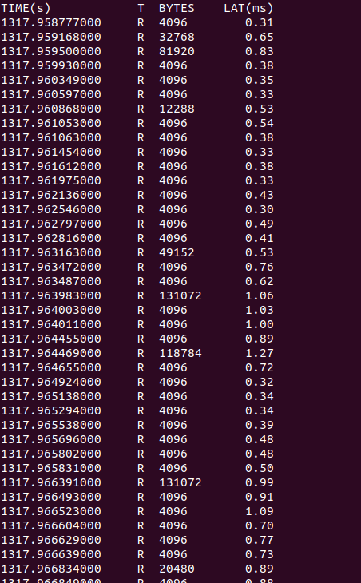
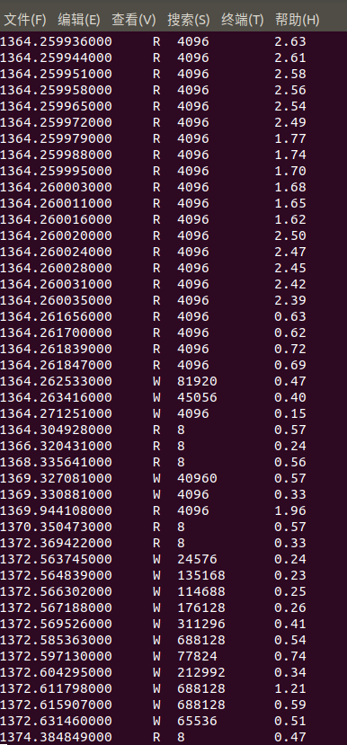

# 个人进度报告（总）
* 任务 : eBPF/XDP研究和运行
## BPF（eBPF）
### 架构简介
* 指令集
    * BPF是一个通用的RISC指令集，它由11个64位寄存器和32位子寄存器，一个程序计数器和一个512字节的大BPF堆栈空间组成。

    * [指令集规范参考](https://github.com/iovisor/bpf-docs/blob/master/eBPF.md)

* MAP


    * map是驻留在内核空间的键/值对，可以通过bpf访问，以便在多个bpf中共享。其实现由内核空间提供

* 尾调用(Tail call)
    * 在程序结尾调用另一bpf程序并且不再返回

* BPF to BPF Call
    * 新添加的功能，和函数调用类似

### BCC(BPF Compiler Collection)
BCC 可作为eBPF的前端，此处简要介绍通过bcc研究和开发eBPF代码的过程。

> BCC使BPF程序更易于编写，内核工具使用C语言（包括一个围绕LLVM的C包装器），以及Python和lua中的前端。它适用于许多任务，包括性能分析和网络流量控制。

一个基于BCC代码由python和C两部分组成，其中C代码为可被挂载到内核的eBPF程序。

关于对此C代码的阅读可参考如下链接中的说明

[说明](https://github.com/iovisor/bcc/blob/master/docs/reference_guide.md)

### ***Example***（通过BCC研究并加载bpf代码）
示例代码取自[此处](https://github.com/iovisor/bcc/blob/master/examples/tracing/disksnoop.py)

以下为其中的C片段：

```
#include <uapi/linux/ptrace.h>
#include <linux/blkdev.h>

BPF_HASH(start, struct request *);
void trace_start(struct pt_regs *ctx, struct request *req) {
	// stash start timestamp by request ptr
	u64 ts = bpf_ktime_get_ns();
	start.update(&req, &ts);
}
void trace_completion(struct pt_regs *ctx, struct request *req) {
	u64 *tsp, delta;
	tsp = start.lookup(&req);
	if (tsp != 0) {
		delta = bpf_ktime_get_ns() - *tsp;
		bpf_trace_printk("%d %x %d\\n", req->__data_len,
		    req->cmd_flags, delta / 1000);
		start.delete(&req);
	}
}
```

从上一节中提及的[说明](https://github.com/iovisor/bcc/blob/master/docs/reference_guide.md)中可查询到BPF_HASH的作用：

> Syntax: `BPF_HASH(name [, key_type [, leaf_type [, size]]])`

> Creates a hash map (associative array) named name, with optional parameters.

> Defaults: `BPF_HASH(name, key_type=u64, leaf_type=u64, size=10240)`

> For example:

> `BPF_HASH(start, struct request *);`

> This creates a hash named start where the key is a struct request *, and the value defaults to u64. This hash is used by the disksnoop.py example for saving timestamps for each I/O request, where the key is the pointer to struct request, and the value is the timestamp.

注：函数trace_start和trace_completion为自己定义的函数，用于跟踪I/O设备

程序运行结果如下：






### 小结
BCC作为开发eBPF的前端工具是不错的选择，但其中的xdp示例代码较少，而且利用python在安卓上加载eBPF/XDP的可行性未知(可行性报告时未曾预料到python前端的出现)。目前BCC仅是我们学习eBPF的工具。

## XDP
* 此处参考了一些[xdp教程](https://github.com/xdp-project/xdp-tutorial)

* 采用C为前端

### linux中的xdp
以C为前端编写的XDP BPF代码（以后均记为xxx_kern.c）并不能直接运行或加载到内核中。一般需要两个步骤
* 通过clang/llvm生成xxx_kern.o文件
* 通过特殊的方法加载到内核

#### 生成.o文件
下载工具链（参见上述xdp教程）
运行如下命令：
```
clang -O2 -Wall -target bpf -c test_xdp_kern.c -o test_xdp_kern.o
```
这里就可能涉及到库的依赖问题，在不成功时需要将特定的库加入编译选项，例如：

```
clang -O2 -Wall -target bpf -I../libbpf/src/ -I/root/usr/include/ -I../headers/  -c test_xdp_kern.c -o test_xdp_kern.o
```

将XDP BPF代码（xxx_kern.o）加载到内核有不同的方法，这里介绍两种常用方法
#### iproute2
这是linux用于管理网络的工具包，利用这个工具能直接将文件加载到内核中，示例如下：
```
ip link set lo xdpgeneric object test_xdp_kern.o sec xdp
```
(权限不足时加sudo)

lo：设备名称（可以通过ip link show查看）

test_xdp_kern.o:要加载的内容

sec xdp：这与代码本身的内容有关

想要将设备上的xdp代码卸下也很简单

```
ip link set lo xdpgeneric off
```
这方法虽然好用，但有一定的缺陷。其与bpf中的map可能无法兼容，会对xdp代码本身有所限制

#### 自己写加载器
打开linux里的samples/bpf中有时会发现与xxx_kern.c对应的一个xxx_user.c文件(并非绝对)

这里的user文件即为加载器，可以将kern文件加载到内核中，对于不同的kern文件，自然要编写不同的user文件与之对应。

To be continue...

#### 函数查询
在xxx_kern.c中可以使用已经存在的函数，具体内容可以到“bpf.h”中查看相关的介绍。这里摘录一段以供示范。
```
/* BPF helper function descriptions:
 *
 * void *bpf_map_lookup_elem(&map, &key)
 *     Return: Map value or NULL
 *
 * int bpf_map_update_elem(&map, &key, &value, flags)
 *     Return: 0 on success or negative error
 *
 * int bpf_map_delete_elem(&map, &key)
 *     Return: 0 on success or negative error
 *
 * int bpf_probe_read(void *dst, int size, void *src)
 *     Return: 0 on success or negative error
 *
  . . . . . .

```

### ***Example***
示例代码如下：
```
#include <linux/bpf.h>
#include "bpf_helpers.h"

SEC("xdp_pass")
int  xdp_pass_func(struct xdp_md *ctx)
{
	return XDP_PASS;
}

SEC("xdp_drop")
int  xdp_drop_func(struct xdp_md *ctx)
{
	return XDP_DROP;
}

SEC("xdp_abort")
int  xdp_abort_func(struct xdp_md *ctx)
{
	return XDP_ABORTED;
}

char _license[] SEC("license") = "GPL";
```
#### 分析
xdp_pass:什么也不做

xdp_drop:丢包（全部丢掉）

xdp_abort:也是丢包，但xdp_drop不同，它触发了名为xdp:xdp_exception的跟踪点

#### 加载 & 效果

### iproute2 on android

## 学习资料

[深入理解BPF](https://linux.cn/article-9507-1.html)

[BPF and XDP Reference Guide](http://docs.cilium.io/en/stable/bpf/#bpf-architecture)

[xdp教程](https://github.com/xdp-project/xdp-tutorial)