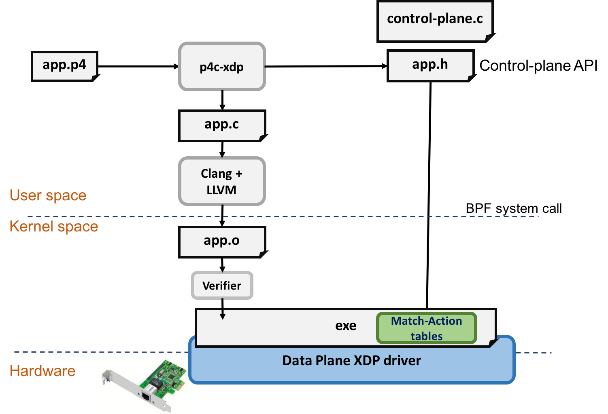

# XDP on android意义
## android

根据Cisco公司的的预测，在接下来的五年中，全球网络流量也将会高速的增长。到2022年，智能手机将占全球互联网流量的50%。

考虑到网络的飞速发展和Android设备在5G时代不可替代的作用，Android设备的网络处理能力至关重要。我们将XDP移植至Android平台，从而实现移动设备高效的网络处理能力，并实现一些通过XDP能达成的高级功能。

## XDP 优点

XDP在提高包处理能力的同时，相较于kernel bypass 技术，有以下优点

- 能保留内核安全性和管理兼容性

- 能根据需要有选择的利用现有内核堆栈

- 能提供稳定的编程接口

- 对应用完全透明

- 可以在不产生服务中断的情况下动态重新编程 

因此，我们选择了XDP作为移植对象。

## XDP应用

XDP技术在linux平台已经得到了广泛的应用。我们期待为android移动设备搭建一个高效的XDP应用开发平台，为类似应用在android 平台上的发展提供可能。

### DDoS缓解，防火墙

基本的XDP BPF功能之一是告诉驱动程序`XDP_DROP`在此早期阶段丢弃数据包，这允许任何类型的有效网络策略实施，具有极低的每数据包成本。这在需要应对任何类型的DDoS攻击的情况下是理想的.

### 转发和负载均衡

XDP的另一个主要用例是通过其中一个`XDP_TX`或多个`XDP_REDIRECT`动作进行数据包转发和负载平衡。该数据包可以由在XDP层中运行的BPF程序任意修改，甚至BPF辅助函数可用于增加或减少数据包的余量，以便在再次发送之前任意封装分别对数据包进行解封装.

#### Katran 

Katran是一个C ++库和BPF程序，用于构建高性能的第4层负载均衡转发平面。 Katran利用内核中的XDP基础架构为快速数据包处理提供内核工具。

​								L4 load balancing network topology

### XDP as a building block

XDP可以作为其它更高级别应用程序的运行时环境，事实上，linux上已经有这样的例子。

#### cilium

Cilium是一个开源软件，用于透明地提供和保护使用Kubernetes，Docker和Mesos等Linux容器管理平台部署的应用程序服务之间的网络和API连接。

下图是 Cilium 的组件示意图，Cilium 是位于 Linux kernel 与容器编排系统的中间层。向上可以为容器配置网络，向下可以向 Linux 内核生成 BPF 程序来控制容器的安全性和转发行为。

#### p4c-xdp

这项工作提出了一个针对XDP（即eXpress数据路径）的P4编译器后端。 P4是一种特定于域的语言。使用P4，程序员专注于定义协议解析，匹配和操作执行，而不是特定于平台的语言或实现细节。

此项工作兼有p4和XDP的优点，下图体现了p4c-xdp的架构。

将xdp 移植到android上，我们期待在android上实现类似功能。

