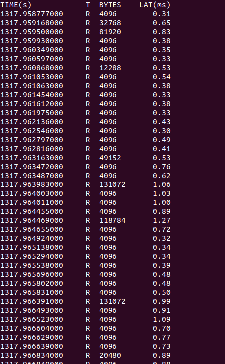
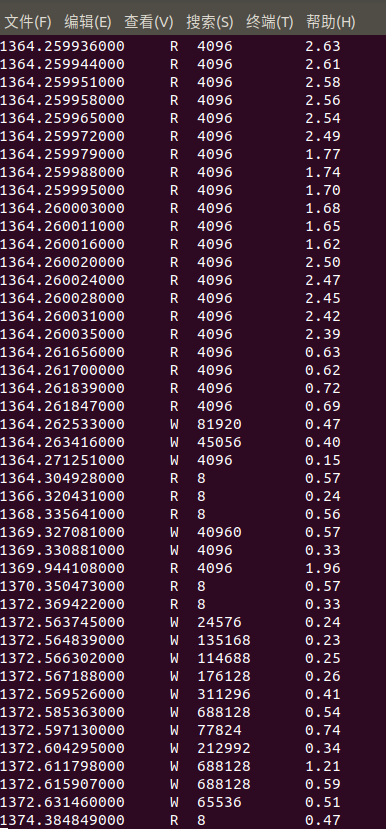

# BCC(BPF Compiler Collection)
BCC 可作为eBPF的前端，此处简要介绍通过bcc研究和开发eBPF代码的过程。

> BCC使BPF程序更易于编写，内核工具使用C语言（包括一个围绕LLVM的C包装器），以及Python和lua中的前端。它适用于许多任务，包括性能分析和网络流量控制。

一个基于BCC代码由python和C两部分组成，其中***C代码为可被挂载到内核的eBPF程序***

关于对此C代码的阅读可参考如下链接中的说明

[说明](https://github.com/iovisor/bcc/blob/master/docs/reference_guide.md)

# ***Example***（通过BCC研究并加载bpf代码）
示例代码取自[此处](https://github.com/iovisor/bcc/blob/master/examples/tracing/disksnoop.py)

以下为其中的C片段：

```
#include <uapi/linux/ptrace.h>
#include <linux/blkdev.h>

BPF_HASH(start, struct request *);
void trace_start(struct pt_regs *ctx, struct request *req) {
	// stash start timestamp by request ptr
	u64 ts = bpf_ktime_get_ns();
	start.update(&req, &ts);
}
void trace_completion(struct pt_regs *ctx, struct request *req) {
	u64 *tsp, delta;
	tsp = start.lookup(&req);
	if (tsp != 0) {
		delta = bpf_ktime_get_ns() - *tsp;
		bpf_trace_printk("%d %x %d\\n", req->__data_len,
		    req->cmd_flags, delta / 1000);
		start.delete(&req);
	}
}
```

从上一节中提及的[说明](https://github.com/iovisor/bcc/blob/master/docs/reference_guide.md)中可查询到BPF_HASH的作用：

> Syntax: `BPF_HASH(name [, key_type [, leaf_type [, size]]])`

> Creates a hash map (associative array) named name, with optional parameters.

> Defaults: `BPF_HASH(name, key_type=u64, leaf_type=u64, size=10240)`

> For example:

> `BPF_HASH(start, struct request *);`

> This creates a hash named start where the key is a struct request *, and the value defaults to u64. This hash is used by the disksnoop.py example for saving timestamps for each I/O request, where the key is the pointer to struct request, and the value is the timestamp.

注：函数trace_start和trace_completion为自己定义的函数，用于跟踪I/O设备

通过python部分加载到内核得到运行结果如下：





