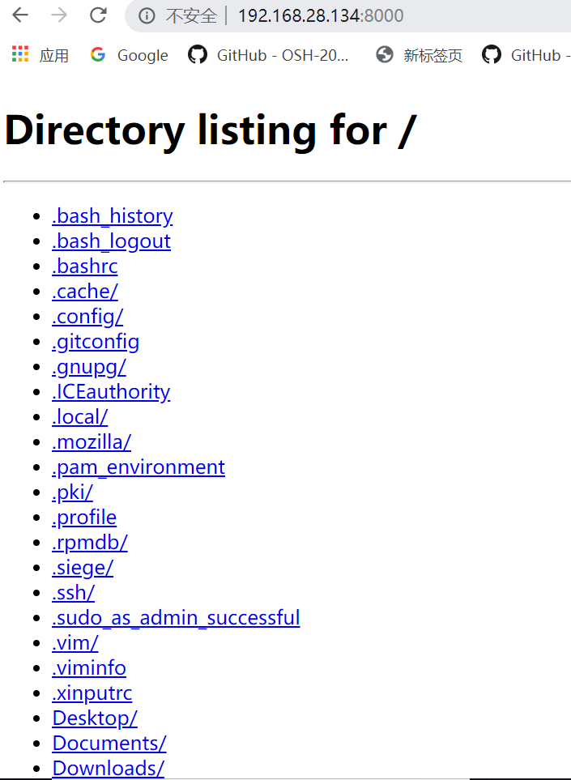
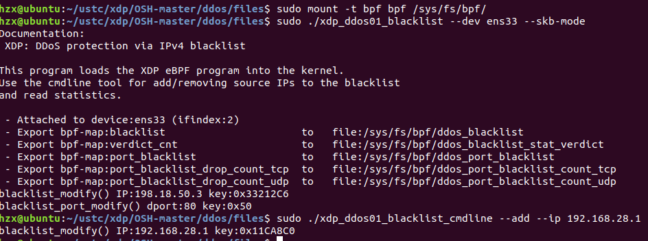
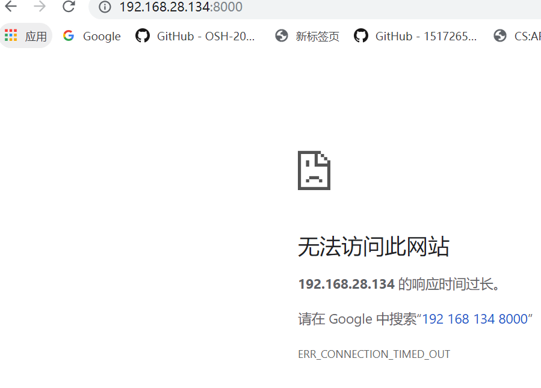

# Example

## example1
[代码地址](../files/xdp_kern.c)

代码如下：

```
#include <linux/bpf.h>
#include "bpf_helpers.h"

SEC("xdp_pass")
int  xdp_pass_func(struct xdp_md *ctx)
{
	return XDP_PASS;
}

SEC("xdp_drop")
int  xdp_drop_func(struct xdp_md *ctx)
{
	return XDP_DROP;
}

SEC("xdp_abort")
int  xdp_abort_func(struct xdp_md *ctx)
{
	return XDP_ABORTED;
}

char _license[] SEC("license") = "GPL";
```
分析

* xdp_pass:什么也不做
* xdp_drop:丢包（全部丢掉）
* xdp_abort:一般用于异常情况的丢包

#### 加载 & 效果
编译：（在工具链中）
```
clang -S -nostdinc -isystem /usr/lib/gcc/x86_64-linux-gnu/7/include -I./kernel/include -I/lib/modules/4.18.0-20-generic/build//arch/x86/include -I/lib/modules/4.18.0-20-generic/build//arch/x86/include/generated/uapi -I/lib/modules/4.18.0-20-generic/build//arch/x86/include/generated -I/lib/modules/4.18.0-20-generic/build//include -I/lib/modules/4.18.0-20-generic/build//arch/x86/include/uapi -I/lib/modules/4.18.0-20-generic/build//include/uapi -I/lib/modules/4.18.0-20-generic/build//include/generated/uapi -include /lib/modules/4.18.0-20-generic/build//include/linux/kconfig.h -Werror \
    -D__KERNEL__ -D__ASM_SYSREG_H \
    -D__BPF_TRACING__ \
    -Wall \
    -Wno-unused-value -Wno-pointer-sign \
    -D__TARGET_ARCH_ \
    -Wno-compare-distinct-pointer-types \
    -Wno-gnu-variable-sized-type-not-at-end \
    -Wno-tautological-compare \
    -Wno-unknown-warning-option \
    -Wno-address-of-packed-member \
    -O2 -emit-llvm -c xdp_kern.c -o xdp_kern.ll
llc -march=bpf -filetype=obj -o xdp_kern.o xdp_kern.ll
```

加载：
```
sudo ip link set **** xdpgeneric object xdp_kern.o sec xdp_drop
//****为网络端口，可以通过ip link 查询
```
输入ip link会发现xdp已经加载成功

打开浏览器会发现已经无法使用网络，电脑会drop所有的数据包

## example2

xdp_ddos

## 代码说明
***源代码来自[此处](https://github.com/netoptimizer/prototype-kernel/tree/master/kernel/samples/bpf)***

将无关ddos的文件删除后放在[这里](../files)

### user
***xdp_ddos01_blacklist_user.c文件为加载器***

### cmdline
***xdp_ddos01_blacklist_cmdline.c文件用于为黑名单增/删ip***

### kern

***xdp_ddos01_blacklist_kern.c文件需要加载到内核（生成bpf），功能为拒绝黑名单中的ip(?)访问网络***

接下来是简单的说明：

```
struct bpf_map_def SEC("maps") blacklist = {
	.type        = BPF_MAP_TYPE_PERCPU_HASH,
	.key_size    = sizeof(u32),
	.value_size  = sizeof(u64), /* Drop counter */
	.max_entries = 100000,
	.map_flags   = BPF_F_NO_PREALLOC,
};

struct bpf_map_def SEC("maps") port_blacklist = {
	.type        = BPF_MAP_TYPE_PERCPU_ARRAY,
	.key_size    = sizeof(u32),
	.value_size  = sizeof(u32),
	.max_entries = 65536,
};

```
***以上两个map为黑名单***

其余的map有：

* verdict_cnt:计数每个xdp操作（XDP_DROP/XDP_PASS...）的个数
* port_blacklist_drop_count_tcp:记录tcp drop的个数
* port_blacklist_drop_count__udp:记录udp drop的个数

函数parse_ipv4解析ip，如果在blacklist中查找到就执行XDP_DROP，并计数:
```
	value = bpf_map_lookup_elem(&blacklist, &ip_src);
	if (value) {
		*value += 1; /* Keep a counter for drop matches */
		return XDP_DROP;
	}

```

函数parse_port解析端口，如果在port_blacklist中查找到就执行XDP_DROP，判断tcp/udp并计数:
```
	dport_idx = dport;
	value = bpf_map_lookup_elem(&port_blacklist, &dport_idx);

	if (value) {
		if (*value & (1 << fproto)) {
			struct bpf_map_def *drop_counter = drop_count_by_fproto(fproto);
			if (drop_counter) {
				drops = bpf_map_lookup_elem(drop_counter , &dport_idx);
				if (drops)
					*drops += 1; /* Keep a counter for drop matches */
			}
			return XDP_DROP;
		}
	}
	return XDP_PASS;

```

## 运行展示
编译：make

加载前：



加载：



加载后：


